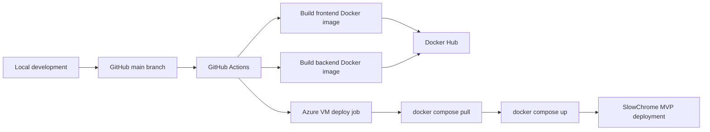

# SlowChrome Showcase

SlowChrome is a motorcycle customization prototype that turns a rider's bike photo into an AI-assisted future-build concept, with a production-style deployment and observability stack built around the application.

> Production source code is private. I keep this public repository as a recruiter- and interviewer-friendly showcase of the product, architecture, deployment model, and operational work. Source details are available for discussion during interviews.

## Live Demo

- **Current status:** hosted on an Azure Virtual Machine for MVP testing.
- **Public URL:** to be updated after the custom domain and HTTPS setup are finalized.
- **Known deployment gap:** the Azure-hosted version still has an authentication redirect issue that will be resolved together with the domain/DNS work.

## Two-Minute Product Tour

A short demo video will be added here after the domain is finalized.

Suggested tour flow:

1. Open SlowChrome on mobile.
2. Upload a motorcycle photo.
3. Validate the image through the FastAPI/YOLO backend.
4. Generate a future-build concept.
5. Save the build to the cloud garage when authentication is enabled.
6. Show the Grafana dashboards for backend health, infrastructure saturation, logs, traces, and alerts.

## Product Summary

SlowChrome explores a focused customization workflow for Harley-style motorcycle owners:

- **Guided bike upload:** riders provide a photo of their motorcycle.
- **Image validation:** a backend detector checks whether the photo is usable before running the AI flow.
- **Style guidance:** the UI helps users explore build styles, parts, and visual direction.
- **AI future-build render:** a server-side route calls OpenAI image generation while keeping the API key off the client.
- **Cloud garage:** Supabase authentication, database rows, Row Level Security, and private storage support account-backed saved builds.
- **Operational stack:** Docker, CI/CD, health checks, metrics, logs, traces, dashboards, alerts, and VM deployment are treated as first-class parts of the project.

## Architecture

```mermaid
flowchart TD
    U[Mobile user] --> FE[Next.js 14 frontend]
    FE --> NX[Next.js API routes]
    NX --> BE[FastAPI backend]
    BE --> YOLO[YOLOv8 motorcycle photo validation]
    NX --> OAI[OpenAI image generation API]
    FE --> SB[Supabase Auth, Database, Storage]

    subgraph Azure VM
        FE
        NX
        BE
        PROM[Prometheus]
        GRAF[Grafana]
        LOKI[Loki]
        ALLOY[Grafana Alloy]
        TEMPO[Tempo]
        OTEL[OpenTelemetry Collector]
        AM[Alertmanager]
        NODE[node-exporter]
        CAD[cAdvisor]
    end

    BE --> MET[/health and /metrics]
    PROM --> MET
    PROM --> NODE
    PROM --> CAD
    BE --> OTEL --> TEMPO
    ALLOY --> LOKI
    PROM --> AM
    GRAF --> PROM
    GRAF --> LOKI
    GRAF --> TEMPO
    GRAF --> AM
```

## Deployment Model



## SRE and DevOps Highlights

| Area | What was implemented |
| --- | --- |
| Containerization | Separate Docker images for the Next.js frontend and FastAPI backend. |
| Service boundaries | Browser traffic goes through the frontend; backend port `8000` stays internal to the Docker network. |
| Health checks | FastAPI exposes `/health`; production Compose uses backend health checks before starting dependent services. |
| CI/CD | Pushes to `main` build frontend/backend Docker images, push tags to Docker Hub, and deploy to the Azure VM. |
| Runtime configuration | Environment variables separate public browser config from server-only keys such as `OPENAI_API_KEY`. |
| Cloud deployment | Azure Ubuntu VM runs Docker Compose for the app and monitoring stack. |
| Auth and data security | Supabase Auth, user-owned tables, Row Level Security, and private image storage are designed into the cloud-save flow. |
| Observability | Metrics, dashboards, logs, traces, and alerts are provisioned with infrastructure-as-code style configuration. |
| Alerting | Prometheus alert rules feed Alertmanager, with email notification configuration managed through secrets. |
| Operational access | Monitoring services bind to localhost and are accessed through SSH tunnels instead of being exposed publicly. |

## Observability Stack

SlowChrome includes a five-phase observability setup:

1. **Backend golden signals:** FastAPI Prometheus metrics, Prometheus scraping, and Grafana dashboard provisioning.
2. **Infrastructure saturation:** node-exporter for VM CPU/memory/disk/network and cAdvisor for Docker container saturation.
3. **Container logs:** Loki and Grafana Alloy collect logs from SlowChrome containers.
4. **Distributed tracing:** OpenTelemetry instrumentation sends FastAPI traces through the OpenTelemetry Collector to Tempo.
5. **Alerting:** Prometheus rules, Alertmanager routing, and a Grafana alerting overview dashboard.

Dashboards created for the project:

- SlowChrome Backend Golden Signals
- SlowChrome Infrastructure Saturation
- SlowChrome Container Logs
- SlowChrome Alerting Overview

## CI/CD Pipeline

The deployment pipeline is designed around reproducible images and a small VM runtime:

1. Checkout repository.
2. Build frontend image from `Dockerfile.frontend`.
3. Build backend image from `backend/Dockerfile`.
4. Push `latest` and commit-SHA image tags to Docker Hub.
5. Sync Docker Compose and monitoring configuration to the Azure VM.
6. Start or update the app stack with Docker Compose.
7. Run the app behind the VM's public frontend port during MVP testing.

Planned hardening:

- Use immutable commit-SHA tags in production deployment instead of `latest`.
- Add post-deploy smoke tests.
- Document rollback to the previous known-good image.
- Move from raw VM port access to domain + HTTPS reverse proxy.

## Monitoring and Alerting

Initial alert rules cover backend availability and operational health. The monitoring stack tracks:

- Backend scrape health
- HTTP traffic by route
- 5xx error rate
- p95 latency
- VM CPU, memory, disk, and network utilization
- Container CPU and memory usage
- Container restarts
- Frontend and backend logs
- OpenTelemetry traces for backend routes
- Firing and pending alerts by severity

## Troubleshooting Stories

### Keeping the backend private while preserving browser uploads

The upload flow initially needed browser access to image validation, but exposing the FastAPI backend directly would have widened the public surface area. The current architecture routes the browser to a Next.js API endpoint, then proxies the request to `http://backend:8000` inside the Docker network. This keeps backend port `8000` internal while preserving a simple frontend integration.

### Designing cloud saves without weakening privacy

The cloud garage uses Supabase Auth plus user-owned database rows and private storage. Row Level Security policies restrict reads and writes by authenticated user, and browser configuration only receives the public anonymous key. Service-role keys and OpenAI credentials stay server-side.

### Making observability useful on a single VM

Instead of exposing Grafana, Prometheus, Loki, Tempo, or Alertmanager publicly, monitoring services bind to `127.0.0.1` and are accessed with SSH tunnels. That keeps the MVP operationally inspectable without turning internal dashboards into public endpoints.

## Tech Stack

### Application

- Next.js 14 App Router
- React 18
- TypeScript
- Tailwind CSS
- FastAPI
- YOLOv8 / Ultralytics
- OpenCV / Pillow
- OpenAI image generation
- Supabase Auth, Postgres, Storage, and Row Level Security

### Infrastructure and Operations

- Docker and Docker Compose
- GitHub Actions
- Docker Hub
- Azure Virtual Machine
- Prometheus
- Grafana
- node-exporter
- cAdvisor
- Loki
- Grafana Alloy
- Tempo
- OpenTelemetry Collector
- Alertmanager

## Repository Boundary

This public repository intentionally excludes:

- Application source code
- Environment files
- API keys or service-role keys
- Private database connection details
- Proprietary implementation details
- User data or generated private images

It includes only:

- Product and architecture summary
- Deployment and operations summary
- Diagrams and demo placeholders
- Interview-friendly technical highlights

## Roadmap

Near-term production hardening:

- Buy and configure the production domain.
- Add HTTPS through Caddy or Nginx.
- Update Supabase redirect allowlists for the production domain.
- Close public access to raw port `3000`.
- Verify login, cloud saves, and image generation end to end on the production domain.
- Add post-deploy smoke tests and rollback documentation.

Portfolio enhancements:

- Add a two-minute product demo video.
- Add dashboard screenshots with sensitive values redacted.
- Add a concise incident/runbook example.
- Add before/after product screenshots.
- Replace Mermaid diagrams with polished exported architecture images if needed.

