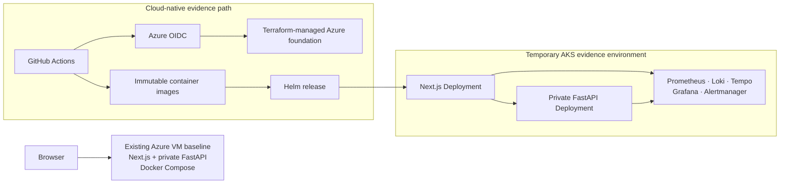
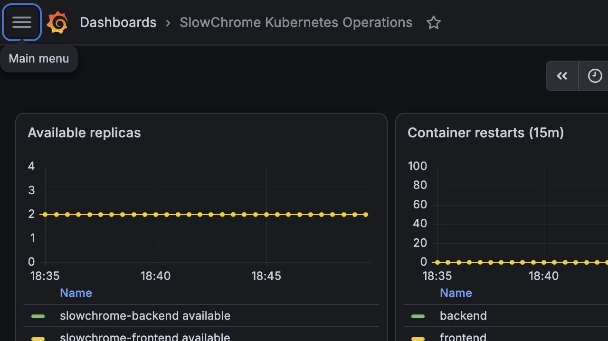
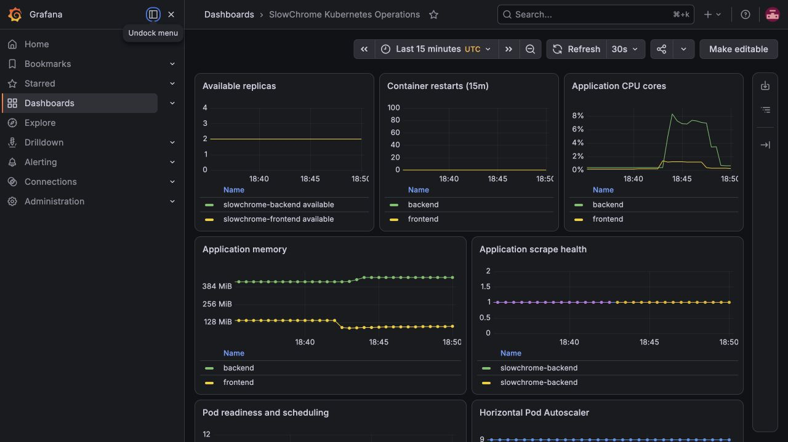

# SlowChrome — Cloud-Native Operations Case Study

**An AI web application evolved from a single Azure VM into a real, time-boxed AKS evidence environment with Terraform, OIDC delivery, Helm, observability, and measured recovery exercises.**

  
  
  
  

  <a href="https://theslowchrome.com">Product Demo</a> ·
  <a href="#recruiter-scan">Recruiter Scan</a> ·
  <a href="#evidence-gallery">Evidence Gallery</a> ·
  <a href="docs/technical-case-study.md">Technical Case Study</a>

---

> **Repository boundary:** this is a public, documentation-only portfolio
> repository. It contains sanitized architecture and operational evidence, not
> application source code, credentials, Terraform state, kubeconfig, private
> logs, Azure resource names, or user data.

## Recruiter Scan

SlowChrome is an AI-assisted motorcycle customization app built with Next.js,
FastAPI, YOLOv8, OpenAI Images, and Supabase. The operational story is more
important here than a list of tools: I started with a debuggable Docker Compose
deployment on Azure, then built a short-lived AKS environment to prove a
cloud-native delivery and recovery path before deciding on a permanent runtime.

| What I built | Why it matters | Evidence to inspect |
| --- | --- | --- |
| Terraform-managed Azure foundation | Infrastructure changes are reviewable and repeatable rather than console-only. | [Technical architecture](docs/technical-case-study.md#3-aks-foundation-and-delivery) |
| GitHub Actions → Azure OIDC → AKS delivery | CI can deploy immutable images without storing a long-lived Azure secret in GitHub. | [Delivery flow](docs/technical-case-study.md#3-aks-foundation-and-delivery) |
| Helm-managed frontend and private backend | The application is deployed as Kubernetes workloads with explicit rollout and rollback behavior. | [AKS topology](docs/technical-case-study.md#4-aks-runtime-topology) |
| Metrics, logs, traces, dashboards, and alerts | Diagnosis is based on correlated operational signals instead of SSH-only debugging. | [Observability](docs/technical-case-study.md#5-kubernetes-observability) |
| Measured recovery exercises | A bad configuration, Pod loss, internal alert-pipeline flow, and planned node maintenance were tested with timestamps. | [Recovery evidence](docs/technical-case-study.md#6-measured-recovery-exercises) |

## What Changed — Without Rewriting History

The existing Azure VM remains the original application baseline. AKS was built
beside it as a real but temporary evidence environment; this Showcase does **not**
claim a DNS cutover, a high-traffic production migration, or that the VM has
already been retired.

The value of the AKS work is therefore not the word “Kubernetes” on its own. It
is a concrete chain from infrastructure definition to delivery identity,
workload health, telemetry, controlled failure, and measured recovery.

## Evidence Gallery

These are static, sanitized screenshots of private operations surfaces. They
contain no credentials, user data, cluster identifiers, IP addresses, or raw
logs.

| Evidence | What it shows |
| --- | --- |
|  | The AKS observability overview after the monitoring stack and application signals became healthy. |
|  | Kubernetes/application signals used for the recovery evidence. |
| [VM observability baseline](assets/grafana-observability-preview.png) | The original single-VM operational baseline that motivated the parallel AKS work. |

## Cloud-Native Proof Points

| Area | Implemented evidence | Deliberate boundary |
| --- | --- | --- |
| Infrastructure | Terraform creates the Azure foundation; state and credentials remain private. | No resource names or state are published. |
| Identity | GitHub Actions authenticates to Azure through OIDC. | No long-lived Azure credential is stored in repository secrets for delivery. |
| Delivery | Immutable images are deployed with Helm; Kubernetes readiness and rollout status gate success. | This is an evidence deployment, not a claim of sustained production traffic. |
| Telemetry | Prometheus, Grafana, Loki, Tempo, Alloy, OpenTelemetry Collector, and Alertmanager ran inside AKS. | Monitoring endpoints are private; no external paging receiver is claimed. |
| Availability controls | Frontend/backend replicas, readiness probes, and a PodDisruptionBudget were exercised. | No multi-region HA or completed SLO observation window is claimed. |

## Measured Recovery Evidence

| Exercise | Measurement | What it demonstrates |
| --- | --- | --- |
| Invalid backend readiness configuration | Detection: **370 s** · recovery: **383 s** | A rejected configuration is visible and the workload returns to Ready after rollback. |
| Frontend Pod loss | Detection: **8 s** · recovery: **9 s** | A Deployment replaces a lost frontend Pod. |
| Backend Pod loss | Detection: **7 s** · recovery: **14 s** | A Deployment replaces a lost backend Pod. |
| Alert pipeline | Detection: **41 s** · clear: **345 s** | Prometheus-to-Alertmanager flow was observed internally. |
| Workload-node drain | Drain completion: **15 s** · controlled recovery: **28 s** | A PDB-guarded planned-maintenance drain reschedules workloads. |

The final row is planned-maintenance timing, not incident MTTD/MTTR. The full
method, timestamps, and caveats are in the [technical case study](docs/technical-case-study.md#6-measured-recovery-exercises).

## Current Status

| Implemented and evidenced | Intentionally not claimed yet |
| --- | --- |
| AKS foundation, OIDC delivery, Helm workloads, Kubernetes observability, and the recovery exercises above | AKS DNS cutover, trusted public TLS on AKS, external Slack/email/PagerDuty paging, SLO compliance, multi-region HA, or a completed Regular-VM migration |
| Existing Docker Compose VM baseline and its original operational evidence | AKS teardown; the temporary environment is retained only until the evidence/cost decision is closed |

## Good Interview Starting Points

- Why use OIDC rather than a long-lived cloud credential in CI?
- How would you distinguish a failed rollout from a healthy-but-slow service?
- Why does a node drain need a PodDisruptionBudget and a post-drain health check?
- What would be required before moving the public domain from the VM baseline to AKS?
- Which observability claims are proven by screenshots and drills, and which need a longer production measurement window?

For the architecture, implementation choices, exact drill scope, and remaining
work, read the [technical case study](docs/technical-case-study.md).

## Technology Snapshot

| Layer | Technologies |
| --- | --- |
| Application | Next.js, React, TypeScript, FastAPI, Python, YOLOv8 |
| Data and AI | Supabase Auth/Postgres/Storage, OpenAI Images |
| Baseline runtime | Docker Compose, Azure VM, HTTPS reverse proxy |
| Cloud-native evidence | AKS, Terraform, Helm, Azure Container Registry, Key Vault, Workload Identity, Gateway API |
| Delivery | GitHub Actions, Azure OIDC, immutable image tags, rollout checks |
| Observability | Prometheus, Grafana, Loki, Tempo, Alloy, OpenTelemetry, Alertmanager |
