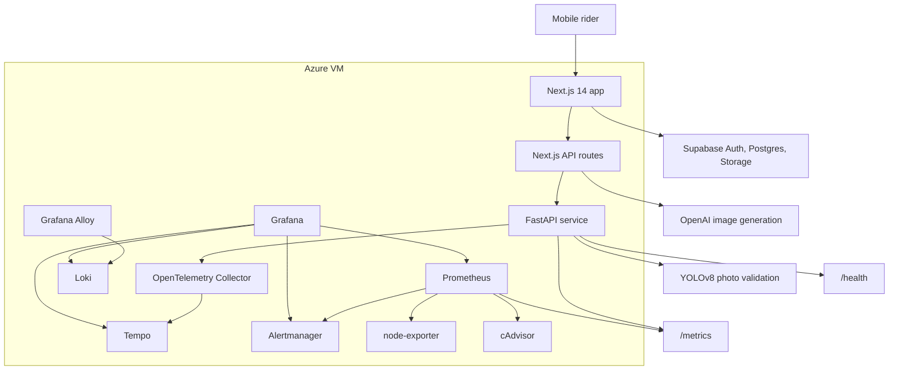
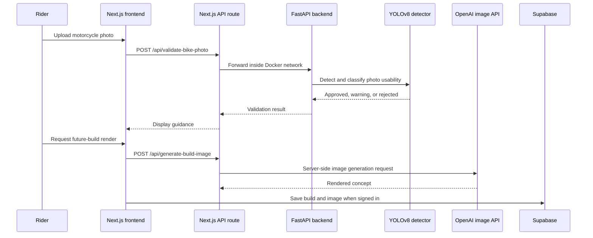
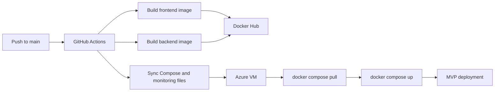

# SlowChrome

**AI-assisted motorcycle customization with a production-style DevOps and observability stack.**

  
  
  
  
  
  

  <a href="#live-demo">Live Demo</a> |
  <a href="#product-tour">Product Tour</a> |
  <a href="#architecture">Architecture</a> |
  <a href="#devops-and-sre-highlights">DevOps/SRE</a> |
  <a href="#observability">Observability</a> |
  <a href="#interview-talking-points">Interview Notes</a>

---

## What This Repository Is

This is a **public portfolio showcase** for SlowChrome. It is designed for recruiters and interviewers who want to understand the product, architecture, deployment model, and operational work without exposing the private production source code.

> Production source code is private. I can discuss architecture, implementation decisions, tradeoffs, and selected code during interviews.

## 30-Second Scan

| Signal | Evidence | Why it matters |
| --- | --- | --- |
| Full-stack product | Next.js frontend, FastAPI backend, OpenAI image route, Supabase cloud garage | Shows end-to-end product execution, not only UI work. |
| AI workflow with guardrails | YOLOv8 motorcycle photo validation before image generation | Reduces poor inputs before calling an expensive AI operation. |
| Cloud deployment | Docker Compose deployment on Azure VM | Demonstrates practical deployment beyond local development. |
| CI/CD | GitHub Actions builds and deploys frontend/backend images | Shows repeatable release workflow. |
| Observability | Prometheus, Grafana, Loki, Tempo, OpenTelemetry, Alertmanager | Shows SRE thinking: metrics, logs, traces, dashboards, alerts. |
| Security boundaries | Internal backend port, server-only API keys, Supabase RLS | Shows attention to secrets, data ownership, and public surface area. |

## Live Demo

| Item | Status |
| --- | --- |
| Azure VM deployment | Running for MVP testing |
| Public URL | Coming after custom domain and HTTPS setup |
| Authentication on deployed site | Known redirect issue; planned to resolve with domain/DNS configuration |
| Source code | Private; available for interview discussion |

## Product Tour

A two-minute video will be added after the domain and HTTPS work is complete.

| Tour moment | What it demonstrates |
| --- | --- |
| Mobile-first product flow | A rider starts a guided customization session. |
| Bike photo upload | The app collects the motorcycle reference image. |
| YOLO validation | FastAPI checks whether the image is usable before generation. |
| Future-build render | The server-side route calls OpenAI image generation without exposing the API key. |
| Cloud garage | Supabase-backed saved builds persist per user when authentication is configured. |
| Grafana walkthrough | Metrics, logs, traces, and alerts are visible from the operations stack. |

## Proof Gallery

| Asset | Status | Notes |
| --- | --- | --- |
| `assets/architecture.png` | Planned | Polished export of the architecture diagram below. |
| `assets/dashboard.png` | Planned | Grafana dashboard screenshot with IPs, emails, and hostnames redacted. |
| `assets/alerts.png` | Planned | Alerting overview screenshot with private values removed. |
| `assets/ci-cd.png` | Planned | GitHub Actions pipeline screenshot with secret values hidden. |
| `demo/demo-video.mp4` or video link | Planned | Short product and operations walkthrough. |

## Architecture

## Product Workflow

## DevOps and SRE Highlights

| Area | Implementation |
| --- | --- |
| Containerization | Separate frontend and backend Docker images. |
| Runtime topology | Browser talks to the frontend; FastAPI stays internal on Docker networking. |
| Health checks | Backend exposes `/health`; Compose waits for backend health before dependent services start. |
| CI/CD | GitHub Actions builds frontend/backend images, pushes Docker Hub tags, and deploys to Azure VM. |
| Config boundaries | Public browser values are separated from server-only secrets such as OpenAI credentials. |
| Cloud persistence | Supabase Auth, user-owned database rows, private image storage, and Row Level Security. |
| Monitoring | Prometheus metrics, Grafana dashboards, node-exporter, cAdvisor. |
| Logs | Loki and Grafana Alloy collect frontend/backend container logs. |
| Traces | OpenTelemetry instrumentation sends FastAPI traces through Collector to Tempo. |
| Alerts | Prometheus alert rules route to Alertmanager with email notification configuration. |

## Deployment Flow

Planned hardening:

- Deploy immutable commit-SHA tags instead of `latest`.
- Add post-deploy smoke tests.
- Document rollback to the previous known-good image.
- Move public traffic from raw VM port access to domain + HTTPS reverse proxy.

## Observability

SlowChrome uses a phased observability stack:

| Phase | Scope | Tools |
| --- | --- | --- |
| 1 | Backend golden signals | FastAPI metrics, Prometheus, Grafana |
| 2 | VM and container saturation | node-exporter, cAdvisor |
| 3 | Container logs | Loki, Grafana Alloy |
| 4 | Distributed tracing | OpenTelemetry, Collector, Tempo |
| 5 | Alerting | Prometheus rules, Alertmanager, Grafana alerting overview |

Dashboard coverage:

- Backend traffic by route
- Backend 5xx rate
- Backend p95 latency
- Backend scrape health
- VM CPU, memory, disk, and network utilization
- Container CPU, memory, and restart signals
- Frontend and backend logs
- Backend traces for routes such as `/health`, `/metrics`, and photo validation
- Firing and pending alerts by severity

Operational note: monitoring services bind to localhost and are accessed through SSH tunnels instead of being exposed to the public internet.

## Security and Data Boundaries

| Boundary | Design choice |
| --- | --- |
| Backend exposure | FastAPI is reached through the frontend proxy and Docker network, not directly by the browser. |
| AI credentials | OpenAI API key stays server-side. |
| Supabase keys | Browser receives only public anonymous configuration. |
| User data | Builds and garage state are user-owned through Row Level Security policies. |
| Image storage | Private storage bucket with per-user path policies. |
| Operations access | Grafana, Prometheus, Loki, Tempo, and Alertmanager are intended for tunnelled access. |
| Public showcase | This repository excludes source code, `.env` files, private logs, tokens, and unredacted screenshots. |

## Troubleshooting Stories

### Backend uploads without a public backend

The browser needs to validate uploaded bike photos, but exposing FastAPI directly would create a wider public surface area. The current design sends browser traffic to a Next.js API route, then proxies to `http://backend:8000` inside Docker. The user flow stays simple while the backend port remains internal.

### Account-backed saves without cross-user data access

Cloud saves use Supabase Auth with user-owned tables, private storage, and Row Level Security. The design goal is that signed-in users can retrieve their own builds while database and storage policies prevent access to another user's saved images.

### Single-VM observability without public dashboards

For the MVP, the monitoring stack runs on the same VM as the app. Grafana, Prometheus, Loki, Tempo, and Alertmanager bind locally and are inspected through SSH tunnels. This keeps the system debuggable without publishing internal operations tools.

## Current Status

| Area | Status |
| --- | --- |
| Local app flow | Working for MVP development |
| Azure VM hosting | Working for MVP testing |
| Dockerized frontend/backend | Implemented |
| GitHub Actions deployment | Implemented |
| Supabase auth and cloud save code | Implemented |
| Deployed auth redirect | Needs domain/DNS follow-up |
| HTTPS/domain | Planned |
| Production smoke tests | Planned |
| Public demo assets | Planned |

## Tech Stack

### Application

  
  
  
  
  
  
  

- YOLOv8 / Ultralytics
- OpenCV / Pillow
- Supabase Auth, Postgres, Storage, and Row Level Security

### Infrastructure and Operations

  
  
  
  
  
  
  

- Docker Hub
- Tempo
- Grafana Alloy
- Alertmanager
- node-exporter
- cAdvisor

## Roadmap

Near-term production hardening:

- [ ] Purchase and configure the production domain.
- [ ] Add HTTPS with Caddy or Nginx.
- [ ] Update Supabase redirect allowlists for the production domain.
- [ ] Remove public access to raw port `3000`.
- [ ] Verify login, cloud saves, and image generation end to end on the production domain.
- [ ] Add post-deploy smoke tests and rollback notes.

Portfolio enhancements:

- [ ] Add a two-minute product video.
- [ ] Add redacted Grafana dashboard screenshots.
- [ ] Add a polished architecture image.
- [ ] Add a short runbook or incident example.
- [ ] Add product screenshots or GIFs.

## Interview Talking Points

- How to keep a backend private while still supporting browser uploads.
- How to structure an AI workflow so validation happens before an expensive generation call.
- How Supabase Row Level Security changes the data model for user-owned builds.
- How to make a single-VM MVP observable without exposing operations dashboards.
- How to evolve the current deployment from raw VM port access to domain, HTTPS, reverse proxy, smoke tests, and rollback.
- What should move from prototype allowances to server-side entitlement enforcement before a paid launch.

## Public Repository Boundary

This repository intentionally contains only showcase material:

- Product and architecture summary
- Deployment and operations summary
- Diagrams and demo placeholders
- Interview-friendly technical highlights

It intentionally excludes:

- Application source code
- `.env` files
- API keys or service-role keys
- Private database connection details
- Private logs
- User data or generated private images
- Unredacted provider dashboards

## README Inspiration

This showcase format was informed by public README patterns from:

- [Best-README-Template](https://github.com/othneildrew/Best-README-Template)
- [awesome-readme](https://github.com/matiassingers/awesome-readme)

