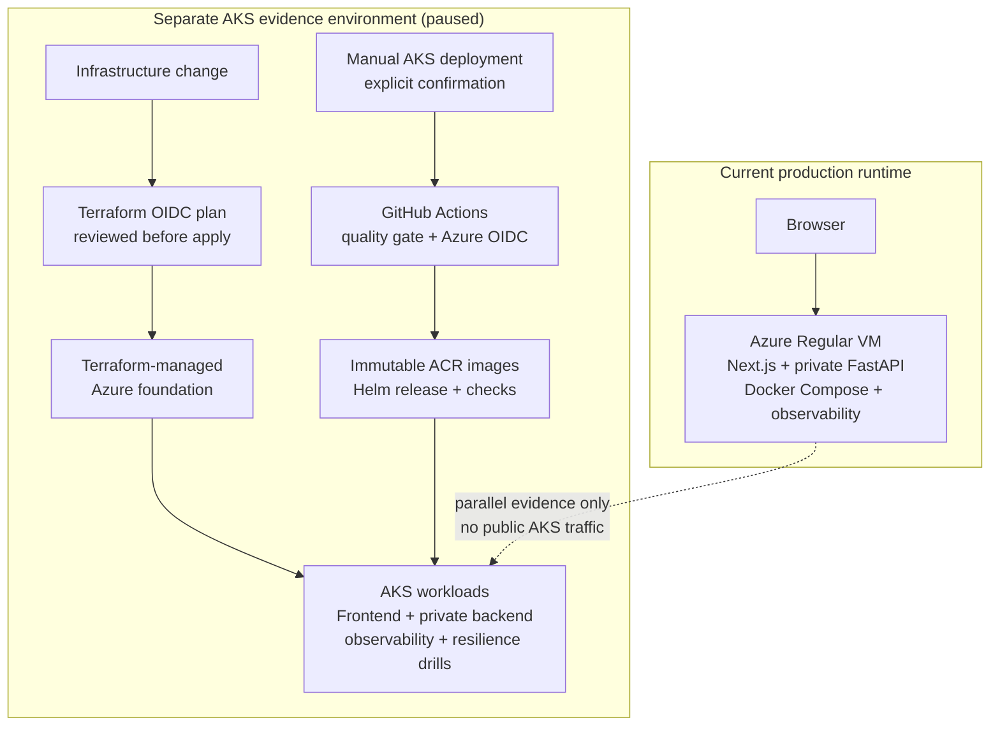

# SlowChrome — Cloud-Native Operations Case Study

**An AI web application evolved from a single Azure VM into a real, time-boxed AKS evidence environment with Terraform, OIDC delivery, Helm, observability, and measured recovery exercises.**

  
  
  
  

  <a href="https://theslowchrome.com">Live Application</a> ·
  <a href="#project-highlights">Project Highlights</a> ·
  <a href="docs/technical-case-study.md">Technical Case Study</a>

---

> **Repository boundary:** this is a public, documentation-only portfolio
> repository. It contains sanitized architecture and operational evidence, not
> application source code, credentials, Terraform state, kubeconfig, private
> logs, Azure resource names, or user data.

## Project Highlights

SlowChrome is an AI-assisted motorcycle customization app built with Next.js,
FastAPI, YOLOv8, OpenAI Images, and Supabase. The operational story is more
important here than a list of tools: I began with a debuggable Docker Compose
deployment on Azure, then built and exercised a short-lived AKS environment to
validate a cloud-native delivery and recovery path. This repository documents
that operational work; it is not a mirror of the private application source.

| What I built | Why it matters | Evidence to inspect |
| --- | --- | --- |
| Terraform-managed Azure foundation | Infrastructure changes are reviewable and repeatable rather than console-only. | [Infrastructure as code](docs/technical-case-study.md#infrastructure-as-code) |
| GitHub Actions → Azure OIDC → AKS delivery | CI can deploy immutable images without storing a long-lived Azure secret in GitHub. | [CI/CD identity and release path](docs/technical-case-study.md#cicd-identity-and-release-path) |
| Helm-managed frontend and private backend | The application is deployed as Kubernetes workloads with explicit rollout and rollback behavior. | [AKS topology](docs/technical-case-study.md#4-aks-runtime-topology) |
| Metrics, logs, traces, dashboards, and alerts | Diagnosis is based on correlated operational signals instead of SSH-only debugging. | [Observability](docs/technical-case-study.md#5-kubernetes-observability) |
| Recovery and resilience drills | A bad configuration, Pod loss, internal alert flow, and planned node maintenance were exercised in a managed cluster. | [Recovery evidence](docs/technical-case-study.md#6-recovery-and-resilience-drills) |

## From VM Baseline to an AKS Evidence Environment

The Azure Regular VM is the current production runtime. AKS ran beside it as a
real, time-boxed environment for building and validating cloud-native delivery,
observability, and recovery practices—not as an immediate public migration.

The current application's traffic and operational needs do not justify the
ongoing cost and complexity of a permanent AKS runtime. The VM is therefore the
more proportionate long-term operating model, while AKS is paused as the
evidence and lifecycle decision are closed. This Showcase does **not** claim a
DNS cutover, sustained public AKS traffic, or that the VM has been retired.

The [VM observability baseline](assets/grafana-observability-preview.png)
captures the current single-host operating model that motivated the parallel
AKS work.

The value of this work is a concrete operating chain: infrastructure definition,
delivery identity, workload health, telemetry, controlled failure, and recovery
validation.

## What Was Built and Verified

| Capability | What was verified |
| --- | --- |
| Infrastructure foundation | Terraform created the Azure foundation for the evidence environment; state and credentials remained private. |
| Delivery identity | GitHub Actions authenticated to Azure through OIDC without requiring a long-lived Azure delivery credential in CI. |
| Release safety | Immutable images were released with Helm, readiness checks, rollout checks, and rollback behavior. |
| Observability | Prometheus, Grafana, Loki, Tempo, Alloy, OpenTelemetry Collector, and Alertmanager ran inside AKS. |
| Availability controls | Frontend/backend replicas, readiness probes, and a PodDisruptionBudget were exercised. |

## Recovery and Resilience Drills

These were intentional, scoped exercises in the AKS evidence environment. They
validate Kubernetes and Helm recovery behavior after a controlled trigger; they
are not user-facing production incidents, SLO measurements, or
operator-response measurements.

| Exercise | What it demonstrates |
| --- | --- |
| Invalid backend readiness configuration | Helm rejects an invalid rollout and restores the known-good backend revision. |
| Frontend Pod loss | A Deployment replaces a deliberately removed frontend Pod. |
| Backend Pod loss | A Deployment replaces a deliberately removed backend Pod. |
| Internal alert flow | Prometheus-to-Alertmanager flow transitions and clears internally. |
| Workload-node drain | A PDB-aware planned-maintenance drain reschedules workloads and restores the expected healthy state. |

The full drill scope and caveats are in the [technical case study](docs/technical-case-study.md#6-recovery-and-resilience-drills).

## Scope and Current State

| Verified | Not claimed or intentionally deferred |
| --- | --- |
| Current production on the Azure Regular VM; AKS foundation, OIDC delivery, Helm workloads, Kubernetes observability, and the recovery drills above | AKS DNS cutover, trusted public TLS on AKS, external Slack/email/PagerDuty paging, SLO compliance, or multi-region HA |
| Docker Compose VM baseline and its operational evidence | AKS remains paused; its teardown or any return to service requires a separate lifecycle and cost decision |

For the architecture, implementation choices, exact drill scope, and remaining
work, read the [technical case study](docs/technical-case-study.md).

## Technology Snapshot

| Layer | Technologies |
| --- | --- |
| Application | Next.js, React, TypeScript, FastAPI, Python, YOLOv8 |
| Data and AI | Supabase Auth/Postgres/Storage, OpenAI Images |
| Baseline runtime | Docker Compose, Azure VM, HTTPS reverse proxy |
| Cloud-native evidence | AKS, Terraform, Helm, Azure Container Registry, Key Vault, Workload Identity, Gateway API |
| Delivery | GitHub Actions, Azure OIDC, immutable image tags, rollout checks |
| Observability | Prometheus, Grafana, Loki, Tempo, Alloy, OpenTelemetry, Alertmanager |
