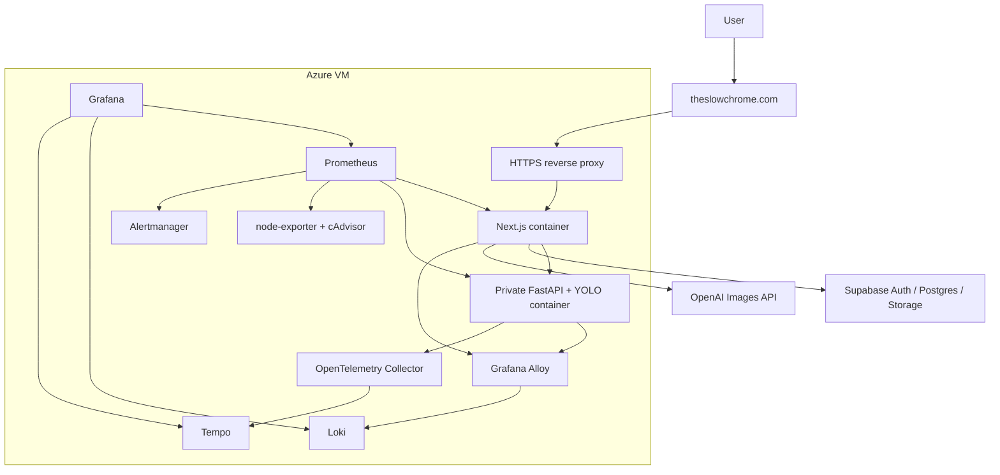
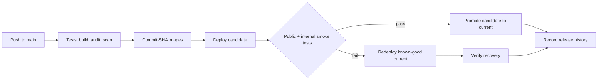

<div align="center">

# SlowChrome SRE / DevOps Case Study

**Operating a live AI web application with traceable releases, automatic recovery, full-stack observability, and an evidence-driven path from a single VM to AKS.**

<p>
  
  
  
  
  
</p>

<p>
  <a href="https://theslowchrome.com">Live Site</a> ·
  <a href="#30-second-summary">30-Second Summary</a> ·
  <a href="#architecture-today">Architecture</a> ·
  <a href="#operational-evidence">Operational Evidence</a> ·
  <a href="docs/technical-case-study.md">Technical Case Study</a>
</p>

</div>

---

> **Repository boundary:** this is a public, documentation-only portfolio
> repository. Production source code, credentials, private logs, Terraform
> state, environment files, kubeconfig, and user data are intentionally excluded.

## 30-Second Summary

SlowChrome is a live motorcycle customization application built with Next.js,
FastAPI, YOLOv8, OpenAI Images, and Supabase. My SRE/DevOps work focuses on
making the application deployable, observable, recoverable, and honest about
its production limits.

| What it demonstrates | Inspectable evidence | Interview angle |
| --- | --- | --- |
| Production delivery | HTTPS site, non-root containers, commit-SHA images, GitHub Actions quality gates | How a commit becomes a traceable release |
| Release safety | Candidate/current/previous deployment state, public smoke tests, automatic known-good recovery, manual rollback | How failed releases avoid becoming known-good |
| Observability | Prometheus metrics, Loki logs, Tempo traces, Grafana dashboards, Alertmanager | How I move from a user symptom to a deployment or infrastructure cause |
| Security boundaries | Private FastAPI service, server-side AI credentials, authenticated bounded renders, Supabase RLS/private storage | How public and privileged paths are separated |
| Reliability engineering | Runbooks, deployment identity, SLO/error-budget design, planned measurable drills | How reliability claims are converted into evidence |
| Cloud-native progression | A staged AKS/Terraform/Helm/OIDC migration design that preserves the VM rollback path | Why I chose parallel migration instead of a big-bang cutover |

## Current Status

| State | Scope |
| --- | --- |
| **Implemented and running** | Azure VM, Docker Compose, HTTPS, immutable images, CI/CD, automatic deployment recovery, metrics, logs, traces, dashboards, and alerts |
| **Implemented in source; external verification still required** | Supabase login/cloud persistence and authenticated OpenAI render flow |
| **Designed and planned** | SLO/error-budget program and the AKS/Terraform migration |
| **Not yet claimed** | AKS production deployment, Kubernetes-native observability, measured Kubernetes recovery drills, or VM retirement |

The current platform is intentionally preserved as a pre-AKS baseline. Future
updates will show before/after evidence rather than rewriting history as if the
system had always run on Kubernetes.

## Architecture Today



The public browser reaches FastAPI only through a Next.js server route. The
backend and monitoring interfaces are not public entry points.

## Release and Recovery Model



The release state has explicit meanings:

- `attempted`: the candidate currently being evaluated.
- `current`: the most recent release that passed smoke tests.
- `previous`: the successful release before current.

A failed candidate is not promoted. The workflow automatically restores and
verifies the known-good current image, records the recovery outcome, and still
reports the candidate deployment as failed for investigation.

## Operational Evidence


| Evidence | What it proves |
| --- | --- |
| [Backend golden signals](assets/grafana-backend-golden-signals.png) | Request rate, errors, p95 latency, and scrape health |
| [Infrastructure saturation](assets/grafana-infrastructure-saturation.png) | VM CPU, memory, disk, network, exporter health, and deployment identity |
| [Container logs](assets/grafana-container-logs.png) | Centralized Loki log search by service |
| [Alerting overview](assets/grafana-alerting-overview.png) | Firing/pending alert state and operational visibility |
| [Technical case study](docs/technical-case-study.md) | Architecture, delivery, security, tradeoffs, recovery, and migration rationale |

Grafana, Prometheus, Loki, Tempo, and Alertmanager remain private. The images in
this repository are static, redacted portfolio evidence captured through an SSH
tunnel.

## Engineering Decisions

- **Keep FastAPI private:** the browser uses a Next.js proxy instead of reaching
  the Python service directly.
- **Use immutable image tags:** a production workload maps to a Git commit and a
  concrete rollback target.
- **Separate attempted from known-good:** deployment success requires smoke-test
  evidence, not merely a running container.
- **Keep telemetry close to the application for the MVP:** the single VM makes
  the stack affordable and debuggable, while external availability monitoring is
  the next independent failure domain.
- **Do not fake horizontal scaling:** render rate-limit and concurrency state are
  process-local, so the frontend remains single-replica until state is shared.
- **Migrate in parallel:** AKS is built and tested beside the VM; DNS moves only
  after observability and recovery gates pass.

## Cloud-Native Migration Program

The next program upgrades the project from a complete single-VM SRE baseline to
verifiable cloud-native operations evidence:

```text
Helm + kind
  -> Terraform remote state and Azure OIDC
  -> ACR + Key Vault + AKS
  -> Gateway API + TLS + atomic delivery
  -> Kubernetes-native metrics, logs, and traces
  -> bad-deploy, Pod-loss, and node-drain drills
  -> measured MTTD and MTTR/RTO
  -> parallel DNS cutover and observed rollback window
```

Planned evidence includes Terraform plans, Helm releases, GitHub OIDC delivery,
Kubernetes events, Prometheus queries, dashboard captures, and timestamped
failure-drill reports. These remain labelled planned until the corresponding
acceptance gates pass.

## Technology

| Layer | Technologies |
| --- | --- |
| Application | Next.js 15, React, TypeScript, FastAPI, Python 3.11 |
| AI and vision | YOLOv8, OpenCV, Pillow, OpenAI Images |
| Identity and data | Supabase Auth, Postgres, RLS, private Storage |
| Current runtime | Docker, Docker Compose, Azure VM, HTTPS reverse proxy |
| Delivery | GitHub Actions, immutable image tags, Docker Hub, smoke tests |
| Observability | Prometheus, Grafana, Loki, Tempo, OpenTelemetry, Alloy, Alertmanager |
| Planned platform | AKS, Terraform, Helm, kind, ACR, Key Vault, Workload Identity, Gateway API |

## Current Limitations

- Production still runs on an interruptible Spot VM.
- The full signed-in cloud-save/render journey needs a recorded production
  verification.
- Backup/restore and measured failure drills are planned but not yet completed.
- SLO/error-budget configuration is designed but not yet production-verified.
- Frontend horizontal scaling requires shared render-control state.
- AKS and Terraform are the next delivery phase, not a completed claim.

## Interview Paths

- Start with this README for the operating model and evidence summary.
- Read the [technical case study](docs/technical-case-study.md) for the
  architecture, failure model, and tradeoffs.
- Open the Grafana evidence to discuss a concrete troubleshooting path.
- Ask why the migration preserves the VM as a DNS rollback origin.
- Ask which claims are implemented, externally verified, designed, or still
  intentionally deferred.
