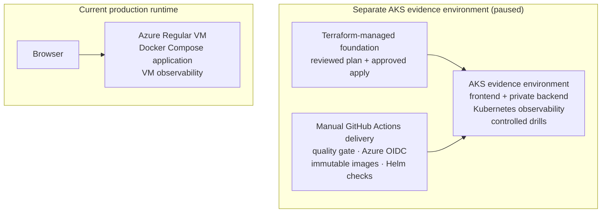

# SlowChrome — Cloud-Native Operations Case Study

**A working motorcycle-customization MVP operated on Azure, with a time-boxed AKS environment used to apply cloud-native delivery, observability, and recovery practices.**

  <a href="https://theslowchrome.com">Live Application</a> ·
  <a href="#project-highlights">Project Highlights</a> ·
  <a href="docs/technical-case-study.md">Technical Case Study</a>

---

> **Repository boundary:** Public, documentation-only portfolio repository with
> sanitized architecture and operational artifacts. Application source, secrets,
> and production access data are not included.

## Project Highlights

SlowChrome is a working motorcycle-customization MVP built with Next.js,
FastAPI, YOLOv8, OpenAI Images, and Supabase. This repository focuses on its
operational evolution: a practical Docker Compose deployment on Azure, local
Kubernetes practice in Minikube, and a time-boxed AKS environment for applying
cloud-native delivery, observability, and recovery practices to the same
application.

| What I built | Why it matters | Details |
| --- | --- | --- |
| Terraform-managed Azure foundation | Infrastructure changes are reviewable and repeatable rather than console-only. | [Infrastructure as code](docs/technical-case-study.md#infrastructure-as-code) |
| GitHub Actions → Azure OIDC → AKS delivery | CI can deploy immutable images without storing a long-lived Azure secret in GitHub. | [CI/CD identity and release path](docs/technical-case-study.md#cicd-identity-and-release-path) |
| Helm-managed frontend and private backend | The application is deployed as Kubernetes workloads with explicit rollout and rollback behavior. | [AKS topology](docs/technical-case-study.md#4-aks-runtime-topology) |
| Metrics, logs, traces, dashboards, and alerts | Diagnosis is based on correlated operational signals instead of SSH-only debugging. | [Observability](docs/technical-case-study.md#5-kubernetes-observability) |
| Recovery and resilience drills | A bad configuration, Pod loss, internal alert flow, and planned node maintenance were exercised in a managed cluster. | [Recovery evidence](docs/technical-case-study.md#6-recovery-and-resilience-drills) |

## Operating the MVP on a VM, Exercising AKS in Parallel

SlowChrome was built first as a working product MVP, not as an infrastructure
exercise. Its public application currently runs on an Azure Regular VM, which
fits the product's present traffic and operating needs.

Alongside the product work, I used the same application locally with Minikube
and then in a time-boxed AKS environment to apply cloud-native delivery,
observability, and recovery practices against a real workload. AKS was not a
public migration: the current product does not justify its ongoing cost and
operational complexity, so the cluster is paused. Any return to service or
teardown requires a separate lifecycle and cost decision.

The [VM observability baseline](assets/grafana-observability-preview.png)
captures the current single-host operating model that motivated the parallel
AKS work.

```mermaid
flowchart LR
    subgraph production["Current production runtime"]
        browser["Browser"] --> vm["Azure Regular VM\nDocker Compose application\nVM observability"]
    end

    subgraph evidence["Separate AKS evidence environment (paused)"]
        direction TB
        foundation["Terraform-managed foundation\nreviewed plan + approved apply"]
        delivery["Manual GitHub Actions delivery\nquality gate · Azure OIDC\nimmutable images · Helm checks"]
        foundation --> aks["AKS evidence environment\nfrontend + private backend\nKubernetes observability\ncontrolled drills"]
        delivery --> aks
    end

    vm ~~~ foundation
```

## Recovery and Resilience Drills

Controlled AKS drills exercised invalid readiness configuration, Pod loss,
internal alert flow, and planned node maintenance. The [technical case
study](docs/technical-case-study.md#6-recovery-and-resilience-drills) records
what each drill validated.

## Scope and Current State

| Verified | Not claimed or intentionally deferred |
| --- | --- |
| Current production on the Azure Regular VM; AKS foundation, OIDC delivery, Helm workloads, Kubernetes observability, and the recovery drills above | AKS DNS cutover, trusted public TLS on AKS, external Slack/email/PagerDuty paging, SLO compliance, or multi-region HA |
| Docker Compose VM baseline and its operational evidence | AKS remains paused; its teardown or any return to service requires a separate lifecycle and cost decision |

For the architecture, implementation choices, exact drill scope, and remaining
work, read the [technical case study](docs/technical-case-study.md).

## Technology Snapshot

| Layer | Technologies |
| --- | --- |
| Application | Next.js, React, TypeScript, FastAPI, Python, YOLOv8 |
| Data and AI | Supabase Auth/Postgres/Storage, OpenAI Images |
| Baseline runtime | Docker Compose, Azure VM, HTTPS reverse proxy |
| Cloud-native evidence | AKS, Terraform, Helm, Azure Container Registry, Key Vault, Workload Identity, Gateway API |
| Delivery | GitHub Actions, Azure OIDC, immutable image tags, rollout checks |
| Observability | Prometheus, Grafana, Loki, Tempo, Alloy, OpenTelemetry, Alertmanager |
