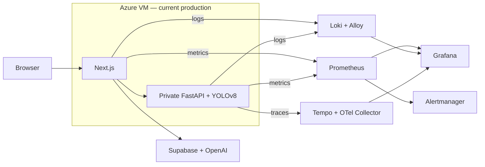

# SlowChrome — SRE & Observability Showcase

**Operating an AI web application with service-level telemetry, incident-first dashboards, tested alerts, and repeatable recovery workflows.**

  
  
  

  <a href="https://theslowchrome.com">Product Demo</a> ·
  <a href="#operational-capabilities">Operational Capabilities</a> ·
  <a href="#incident-overview">Incident Overview</a> ·
  <a href="docs/technical-case-study.md">Technical Case Study</a>

---

> **Repository boundary:** this is a public, documentation-only portfolio
> repository. It contains sanitized architecture and operational evidence, not
> application source code, credentials, Terraform state, kubeconfig, private
> logs, cloud resource identifiers, or user data.

## Overview

SlowChrome is an AI-assisted motorcycle customization application built with
Next.js, FastAPI, YOLOv8, OpenAI Images, and Supabase. The public application
runs on an Azure Regular VM with immutable containers and a Docker Compose
observability stack.

This is a personal project. I designed and implemented the deployment,
application telemetry, dashboards, alert rules, delivery workflows, and
recovery exercises described here.

This repository focuses on the operational work around that application:
telemetry, dashboards, alerting, reliability signals, delivery controls, and
recovery exercises. The [technical case study](docs/technical-case-study.md)
contains the implementation details and all six Grafana dashboard captures.

## Operational Capabilities

| Area | Implementation | Evidence |
| --- | --- | --- |
| Incident response | Grafana opens with user-facing service status and links to focused diagnostic views without losing the selected time range. | [Dashboard system](docs/technical-case-study.md#5-the-six-dashboard-system) |
| Metrics, logs, and traces | HTTP RED signals, business outcomes, dependency calls, infrastructure metrics, structured logs, and backend traces are collected. | [Signal architecture](docs/technical-case-study.md#3-signal-architecture) |
| Dependency diagnosis | Supabase, OpenAI, Garage persistence, render latency, concurrency, and policy rejections are separated into actionable signals. | [Dependency dashboard](docs/technical-case-study.md#53-slowchrome-ai--dependencies) |
| Alerting | Prometheus rules use severity, persistence windows, failure ratios, and minimum event counts to reduce low-traffic noise. | [Alert strategy](docs/technical-case-study.md#6-alert-strategy) |
| Reliability | Availability and render SLIs are recorded over a 14-day window with a minimum-sample gate before an objective is evaluated. | [SLO semantics](docs/technical-case-study.md#7-reliability-and-low-traffic-slo-semantics) |
| Observability as code | Dashboard JSON, stable UIDs, links, PromQL, alert rules, and SLO rules are versioned and covered by automated checks. | [Automated contracts](docs/technical-case-study.md#8-observability-as-code) |

## Runtime and Observability Topology

```mermaid
flowchart LR
    user["Browser"] --> web["Next.js"]
    web --> api["Private FastAPI + YOLOv8"]
    web --> deps["Supabase + OpenAI"]

    subgraph production["Azure VM — current production"]
        web
        api
    end

    web -->|metrics| prom["Prometheus"]
    api -->|metrics| prom
    web -->|logs| loki["Loki + Alloy"]
    api -->|logs| loki
    api -->|traces| tempo["Tempo + OTel Collector"]

    prom --> grafana["Grafana"]
    loki --> grafana
    tempo --> grafana
    prom --> alerts["Alertmanager"]
```

Grafana and the telemetry endpoints are private operator surfaces. They are not
exposed through the public product demo.

## Incident Overview

The default Grafana dashboard begins with public availability and
user-visible capabilities rather than host CPU. It shows Supabase
authentication, OpenAI generation, Garage persistence, active alerts, and
critical scrape health before directing the operator to HTTP, dependency,
infrastructure, logs, or reliability views.

`IDLE` is kept separate from `UNKNOWN`: no recent dependency traffic is not a
verified success, but it is also not a broken datasource. See the
[six-dashboard walkthrough](docs/technical-case-study.md#5-the-six-dashboard-system)
for the complete diagnostic path.

## AKS Experience

I also deployed SlowChrome and its observability stack end to end on AKS using
Terraform, Helm, Azure OIDC, and Workload Identity. I later stopped the cluster
because its ongoing cost and operational overhead were not justified by the
project's current traffic. I continue practicing the Kubernetes workflow
locally with Minikube; the implementation and recovery results are documented
in the [technical case study](docs/technical-case-study.md#9-aks-implementation-and-recovery).

## Scope and Limitations

- The Azure Regular VM is the current production runtime; AKS is not presented
  as the public origin.
- Alertmanager routing is implemented, but external paging delivery is not
  claimed as continuously exercised.
- SLI rules are implemented and queryable; a completed 99.9% SLO observation
  window is not claimed.
- Multi-region availability and a completed backup/restore drill remain outside
  the current evidence set.
