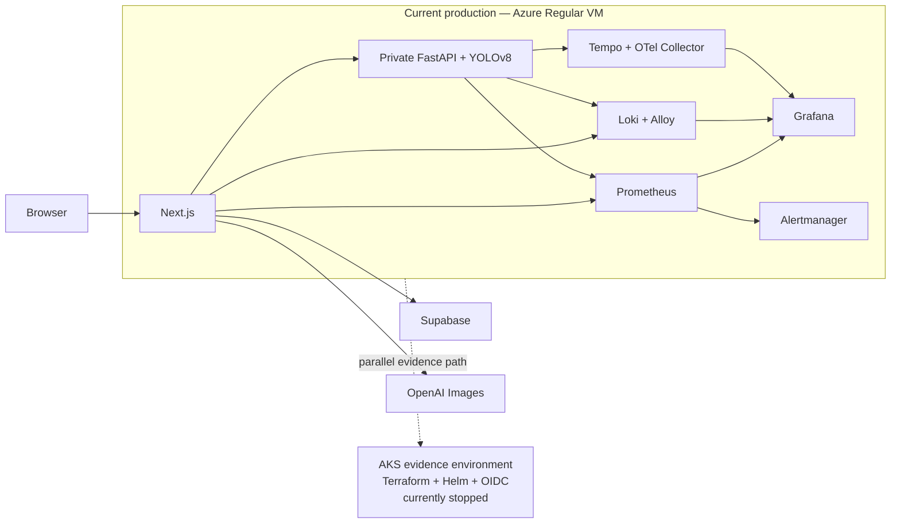
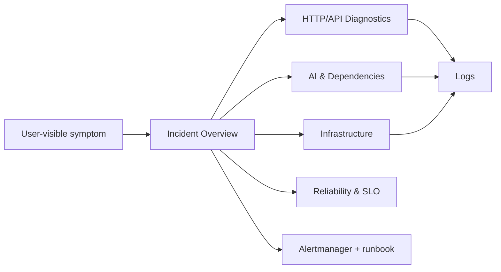
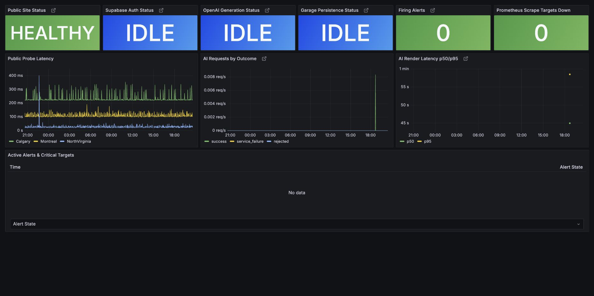
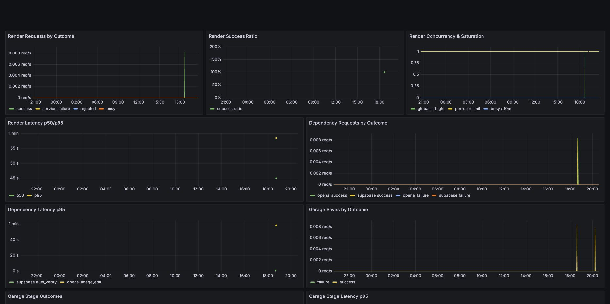
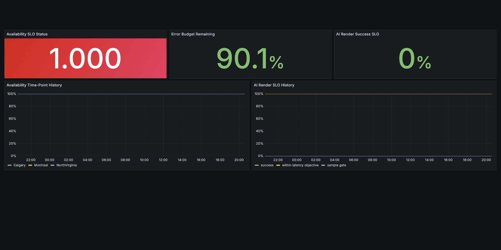

# SlowChrome — SRE & Cloud Operations Case Study

**How an AI web application is operated with incident-first dashboards, service-level telemetry, tested alert rules, immutable delivery, and measured Kubernetes recovery exercises.**

  
  
  
  

  <a href="https://theslowchrome.com">Product Demo</a> ·
  <a href="#recruiter-scan">Recruiter Scan</a> ·
  <a href="#incident-first-observability">Observability</a> ·
  <a href="docs/technical-case-study.md">Technical Case Study</a>

---

> **Repository boundary:** this is a public, documentation-only portfolio
> repository. It contains sanitized architecture and operational evidence, not
> application source code, credentials, Terraform state, kubeconfig, private
> logs, cloud resource identifiers, or user data.

## Recruiter Scan

SlowChrome is an AI-assisted motorcycle customization application built with
Next.js, FastAPI, YOLOv8, OpenAI Images, and Supabase. Its current production
runtime is an Azure Regular VM running immutable application containers and a
complete Docker Compose observability stack. A separate, time-boxed AKS
environment was built and exercised to prove the Kubernetes delivery and
recovery path; local Minikube practice preceded that managed-cluster work. AKS
is now stopped while the evidence is retained.

| What I built | Why it demonstrates SRE capability | Evidence to inspect |
| --- | --- | --- |
| Incident-first Grafana operating model | Starts with user-visible services, then preserves the incident time range while drilling into metrics, logs, dependencies, infrastructure, and SLOs. | [Dashboard system](#incident-first-observability) |
| Service and business telemetry | Measures public availability, HTTP RED signals, AI rendering, Supabase/OpenAI dependencies, Garage persistence, concurrency, and rejected telemetry. | [Technical signal architecture](docs/technical-case-study.md#3-signal-architecture) |
| Alert rules with noise controls | Combines ratios with minimum event counts and sustained `for` windows so a low-traffic application does not page on one sample. | [Alert strategy](docs/technical-case-study.md#6-alert-strategy) |
| Observability as code | Dashboard JSON, stable UIDs, links, PromQL, alert rules, and SLO recording rules are versioned and tested. | [Automated contracts](docs/technical-case-study.md#8-observability-as-code) |
| Terraform, OIDC, Helm, and AKS recovery | Proves an immutable, secretless cloud-native delivery path plus measured rollout, Pod-loss, alert-pipeline, and node-drain exercises. | [AKS evidence](#measured-cloud-native-recovery) |

The strongest evidence is not the number of tools. It is the operating path from
a user-visible symptom to a bounded diagnosis, an actionable alert, a rollback
or recovery action, and post-recovery verification.

## Current Operating Model

```mermaid
flowchart LR
    user["Browser"] --> web["Next.js"]
    web --> api["Private FastAPI + YOLOv8"]
    web --> supabase["Supabase"]
    web --> openai["OpenAI Images"]

    subgraph production["Current production — Azure Regular VM"]
        web
        api
        prom["Prometheus"]
        grafana["Grafana"]
        loki["Loki + Alloy"]
        tempo["Tempo + OTel Collector"]
        alerts["Alertmanager"]
    end

    web --> prom
    api --> prom
    web --> loki
    api --> loki
    api --> tempo
    prom --> grafana
    loki --> grafana
    tempo --> grafana
    prom --> alerts

    aks["AKS evidence environment\nTerraform + Helm + OIDC\ncurrently stopped"]
    production -. "parallel evidence path" .-> aks
```

The production Grafana and telemetry endpoints are private and reached through
authenticated operator access. The public demo is not used as an observability
administration surface.

| Dimension | Current production: Azure Regular VM | AKS evidence environment: stopped |
| --- | --- | --- |
| Public traffic | Serves the public application. | No public DNS cutover or sustained production traffic. |
| Infrastructure | Terraform-managed network boundary with Docker Compose on one VM. | Terraform-managed network, AKS, ACR, Key Vault, Workload Identity, and Gateway API profile. |
| Release path | Push-to-main quality gates, immutable images, Compose deployment, smoke checks, and recovery behavior. | Explicitly confirmed workflow, Azure OIDC, immutable ACR images, Helm rollout, and readiness gates. |
| Runtime tradeoff | Proportionate cost and operational complexity for current traffic. | Stronger orchestration and failure-domain evidence at a cost the current product does not yet justify. |
| Lifecycle | Active production origin. | Stopped pending an explicit restart or teardown decision. |

## Incident-First Observability

Grafana opens on **SlowChrome Incident Overview** rather than a collection of
equally weighted dashboards. The first screen answers whether the public site,
Supabase authentication, OpenAI generation, Garage persistence, active alerts,
or critical Prometheus targets need attention.

```mermaid
flowchart LR
    symptom["User-visible symptom"] --> overview["Incident Overview"]
    overview --> http["HTTP/API Diagnostics"]
    overview --> ai["AI & Dependencies"]
    overview --> infra["Infrastructure"]
    overview --> slo["Reliability & SLO"]
    http --> logs["Logs"]
    ai --> logs
    infra --> logs
    overview --> alerts["Alertmanager + runbook"]
```

Panel links retain the selected time range, so the operator does not lose the
incident window during a drill-down. Logs are used after metrics identify the
failing stage, rather than as the first diagnostic surface.

| Dashboard | Operational question |
| --- | --- |
| **Incident Overview** | Which user-visible capability or critical telemetry path is failing now? |
| **HTTP/API Diagnostics** | Did traffic, status class, route outcome, or p50/p95 latency change? |
| **AI & Dependencies** | Are render outcomes, concurrency, Supabase, OpenAI, or Garage persistence responsible? |
| **Infrastructure** | Is CPU, memory, disk, container health, or scrape health contributing? |
| **Logs** | Which structured application event explains the metric change? |
| **Reliability & SLO** | What do the 14-day availability, error-budget, and AI SLI signals show? |

### Evidence snapshot — incident entry point

The captured 24-hour view shows a healthy public probe, idle low-traffic
dependency paths, zero firing alerts, and zero critical scrape targets down.
`IDLE` is intentional: no recent traffic is different from a verified success or
an unknown datasource state.

### Evidence snapshot — business and dependency diagnosis

The AI drill-down separates successful work, service failures, policy
rejections, and concurrency saturation. It also correlates render latency with
Supabase/OpenAI dependency calls and the multi-stage Garage save path.

### Evidence snapshot — reliability review

This is a configuration and signal snapshot, not a claim that a 99.9% objective
has been achieved. A complete production claim requires validating the full
observation window, probe behavior, sample sufficiency, and retained evidence.

The [technical case study](docs/technical-case-study.md#5-the-six-dashboard-system)
contains all six current dashboard screenshots and explains when each surface is
used.

## Observability as Code

The dashboards are repository-owned operational artifacts rather than manual
Grafana edits:

- exactly six approved SlowChrome dashboards are provisioned from JSON;
- existing dashboard UIDs remain stable so links and bookmarks do not break;
- Incident Overview is tested as the default Grafana home dashboard;
- cross-dashboard links are checked for valid UIDs and preserved time ranges;
- dashboard PromQL and alert expressions have automated contract tests; and
- Prometheus alert and SLO recording rules have explicit rule-test fixtures.

The result is a reviewable change path: a pull request can show how telemetry,
thresholds, navigation, and operator behavior will change before deployment.

## Alert and SLO Boundaries

Alerts cover backend/exporter availability, backend error rate and latency,
Supabase Auth, OpenAI generation, Garage persistence, render saturation,
rejected telemetry, disk pressure, and container restarts. Critical dependency
alerts require both a minimum number of failures and a high failure ratio before
firing; lower-severity infrastructure signals use longer persistence windows.

Prometheus implements 14-day availability and AI render success/latency rules.
The AI SLI has a minimum eligible-request gate, preventing a tiny sample from
being presented as meaningful compliance. Alertmanager routing exists, while
external email delivery depends on deployment secrets and is not claimed here as
a continuously verified paging path.

## Measured Cloud-Native Recovery

The AKS environment was real, deployed in parallel with the then-current VM, and
used for controlled recovery evidence. It was not a simulated manifest exercise
and is not presented as the current public origin.

| Exercise | Measurement | What it demonstrates |
| --- | ---: | --- |
| Invalid backend readiness configuration | detection **370 s** · recovery **383 s** | A rejected revision becomes visible and the known-good workload returns to Ready. |
| Frontend Pod loss | detection **8 s** · recovery **9 s** | A Deployment restores desired state after Pod loss. |
| Backend Pod loss | detection **7 s** · recovery **14 s** | The private backend returns to the expected replica count. |
| Internal alert pipeline | detection **41 s** · clear **345 s** | Prometheus-to-Alertmanager firing and resolution were observed. |
| Workload-node drain | drain **15 s** · controlled recovery **28 s** | PDB-guarded planned maintenance reschedules workloads. |

The node-drain row is maintenance timing, not incident MTTD/MTTR. Methods,
timestamps, and caveats are documented in the
[technical case study](docs/technical-case-study.md#9-measured-aks-recovery-evidence).

## Current Status and Honest Gaps

| Implemented and evidenced | Not claimed |
| --- | --- |
| Active Regular VM application and Compose observability stack | Multi-region high availability |
| Six incident-first Grafana dashboards with current screenshots | Publicly exposed Grafana or Prometheus |
| Metrics, structured logs, traces, alert rules, and deployment correlation | Continuously verified external paging delivery |
| 14-day SLI rules and low-traffic sample gating | Completed 99.9% SLO observation and compliance |
| Terraform/OIDC/Helm AKS path and measured recovery drills | AKS production cutover or sustained production traffic |
| Stopped AKS evidence environment retained for lifecycle review | Completed backup/restore drill or AKS teardown |

## Good Interview Starting Points

- Why should an incident dashboard begin with user journeys instead of CPU?
- How do `IDLE`, `UNKNOWN`, warning, and critical states change operator action?
- Why combine minimum event counts, failure ratios, and `for` windows in a
  low-traffic service?
- How do stable Grafana UIDs and time-preserving links reduce incident-response
  friction?
- What is the difference between implementing an SLI and proving an SLO?
- Why is a PDB-protected node drain a maintenance exercise rather than incident
  MTTD/MTTR?
- When is a cost-efficient VM the more responsible choice than a permanent AKS
  platform?

## Technology Snapshot

| Layer | Technologies |
| --- | --- |
| Application | Next.js, React, TypeScript, FastAPI, Python, YOLOv8 |
| Data and AI | Supabase Auth/Postgres/Storage, OpenAI Images |
| Current runtime | Azure Regular VM, Docker Compose, HTTPS reverse proxy |
| Cloud-native evidence | AKS, Terraform, Helm, Azure Container Registry, Key Vault, Workload Identity, Gateway API |
| Delivery | GitHub Actions, Azure OIDC, immutable image tags, rollout checks |
| Observability | Prometheus, Grafana, Loki, Tempo, Alloy, OpenTelemetry, Alertmanager, external synthetic probes |
