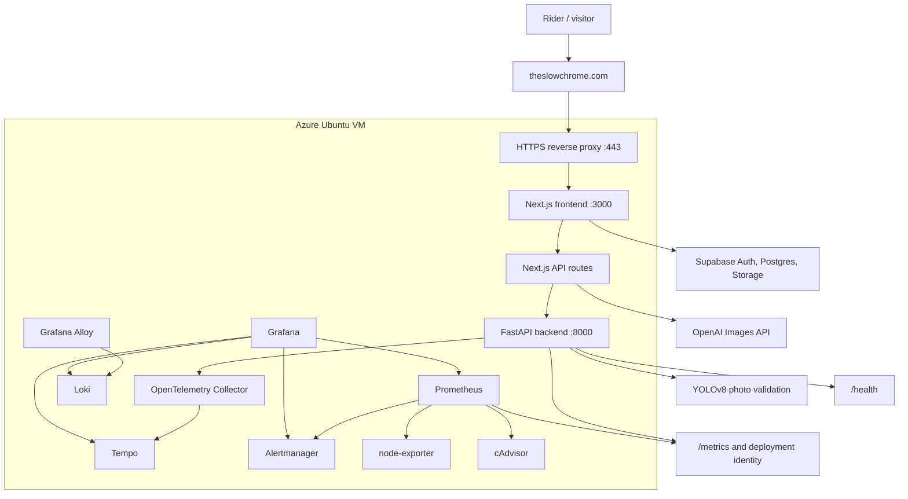
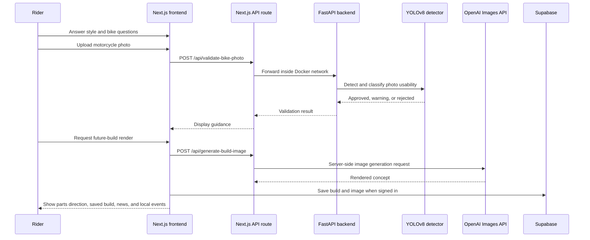
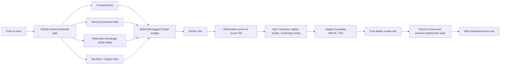
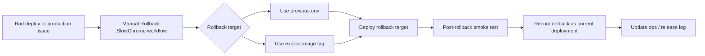

# SlowChrome Technical Case Study

This document is the deeper engineering companion to the recruiter-friendly [README](../README.md). It explains the architecture, production deployment model, observability stack, recovery workflow, security boundaries, and tradeoffs behind SlowChrome.

## System Overview

SlowChrome is an AI-powered motorcycle customization platform. The current MVP combines a mobile-first style flow, motorcycle photo validation, server-side AI image generation, personalized parts direction, cloud-backed saved builds, a manually curated explore feed, and production-style deployment/recovery controls.

## Product Workflow

## Product Surface

| Area | Current implementation |
| --- | --- |
| Homepage | Rebuilt around the core loop: taste answers, AI bike preview, style references, parts drops, news, and local culture. |
| AI style flow | Mobile-first flow for profile selection, style consultation, bike upload, validation, and AI build result. |
| Parts discovery | Curated product direction and representative parts tied to the generated build and user style direction. |
| Cloud garage | Supabase-backed saved builds and garage state with local fallback when cloud config is unavailable. |
| Explore feed | Hand-curated biweekly feed with motorcycle customization news, reference stories, and Vancouver local events calendar. |
| News detail pages | Static news detail routes for feed articles with images and editorial copy. |

## Engineering Highlights

| Area | Implementation |
| --- | --- |
| Frontend | Next.js 14 App Router, React, TypeScript, Tailwind CSS, mobile-first custom motorcycle visual system. |
| Backend | FastAPI service validates uploaded motorcycle photos before the AI image workflow runs. |
| AI workflow | YOLOv8 gates photo quality before server-side OpenAI image generation; OpenAI key stays server-side. |
| Cloud data | Supabase Auth, Postgres, Storage, and Row Level Security support account-owned saved builds and private images. |
| Production entry | `https://theslowchrome.com` routes through a VM reverse proxy to an internal frontend port. |
| Network perimeter | Public web traffic is intended for `80`/`443`; frontend `3000` and backend `8000` are not public entry points. |
| CI/CD | GitHub Actions runs tests, production build, homepage visual sanity, backend tests, deployment tests, Docker build/push, deploy, smoke test, and deployment-state recording. |
| Recovery | Manual rollback workflow can restore the previous deployment state or an explicit image tag, then smoke-test and record the rollback. |
| Observability | Prometheus, Grafana, Loki, Tempo, OpenTelemetry, Alertmanager, node-exporter, and cAdvisor provide app, deployment, and infrastructure visibility. |

## Production Deployment Flow

Key P0/P1 deployment controls:

- Production deploys use commit-derived short-SHA image tags, not `latest`.
- The deploy script refuses mutable `IMAGE_TAG=latest`.
- The deploy job passes production Supabase and OpenAI configuration through GitHub Actions secrets.
- Post-deploy smoke tests check the public HTTPS homepage, local frontend, backend health, and deployment identity metrics.
- Deployment state is recorded under `.runtime/deployments/current.env`, `previous.env`, and `history.log`.

## Rollback and Recovery Flow

Recovery documentation now includes:

- `docs/runbooks/site-down.md`
- `docs/runbooks/bad-deploy-rollback.md`
- `docs/runbooks/disk-full.md`
- `docs/ops-log.md`
- `docs/release-log.md`
- `docs/backup-restore-readiness.md`
- `docs/production-observability-readiness.md`

## Observability Stack

| Phase | Scope | Tools |
| --- | --- | --- |
| 1 | Backend golden signals | FastAPI metrics, Prometheus, Grafana |
| 2 | VM and container saturation | node-exporter, cAdvisor |
| 3 | Container logs | Loki, Grafana Alloy |
| 4 | Distributed tracing | OpenTelemetry, Collector, Tempo |
| 5 | Alerting | Prometheus rules, Alertmanager, Grafana alerting overview |
| P1 addition | Deployment identity and release visibility | `slowchrome_deployment_info`, deployment timestamp metrics, Grafana deployed SHA and deployment events panels |

Dashboard and signal coverage includes:

- Backend traffic by route.
- Backend 5xx rate.
- Backend p95 latency.
- Backend scrape health.
- VM CPU, memory, disk, and network utilization.
- Container CPU, memory, and restart signals.
- Frontend and backend logs.
- Backend traces for routes such as `/health`, `/metrics`, and photo validation.
- Firing and pending alerts by severity.
- Deployed SHA and deployment event visibility.

Operational note: monitoring services bind to localhost and are accessed through SSH tunnels instead of being exposed to the public internet.

## Observability Evidence

The screenshots below were captured from the SlowChrome Grafana instance through a local SSH tunnel on July 12, 2026. They are static, portfolio-safe evidence of the monitoring stack; the live operations dashboards remain private.

| Dashboard | What it demonstrates |
| --- | --- |
| Backend Golden Signals | Traffic, error-rate panel, p95 latency, and FastAPI scrape health. |
| Infrastructure Saturation | VM CPU, memory, disk, network, exporter health, and deployment identity panels. |
| Container Logs | Loki-backed container log search through Grafana. |
| Alerting Overview | Prometheus/Grafana alert visibility for firing and pending alert states. |

### Backend Golden Signals

### Infrastructure Saturation

### Container Logs

### Alerting Overview

## Security and Data Boundaries

| Boundary | Design choice |
| --- | --- |
| Public web entry | Production traffic enters through `https://theslowchrome.com`. |
| Container ports | Frontend `3000` is local/internal; backend `8000` is Docker-network-only. |
| Backend exposure | Browser calls a Next.js API route, which proxies to FastAPI inside the Docker network. |
| AI credentials | OpenAI API key stays server-side and is passed through deployment secrets. |
| Supabase keys | Browser receives only public anonymous configuration. |
| User data | Builds and garage state are user-owned through Row Level Security policies. |
| Image storage | Private storage bucket with per-user path policies. |
| Operations access | Grafana, Prometheus, Loki, Tempo, and Alertmanager are intended for tunnelled access. |
| Public showcase | This repository excludes source code, `.env` files, private logs, tokens, and unredacted screenshots. |

## Troubleshooting Stories

### Backend uploads without a public backend

The browser needs to validate uploaded bike photos, but exposing FastAPI directly would create a wider public surface area. The current design sends browser traffic to a Next.js API route, then proxies to `http://backend:8000` inside Docker. The user flow stays simple while the backend port remains internal.

### Release traceability without a heavy platform

The app still runs on a single Azure VM, so the deployment process records a small runtime state file for the current and previous release. This gives the rollback workflow a concrete target without introducing a larger release-management system.

### Single-VM observability without public dashboards

For the MVP, the monitoring stack runs on the same VM as the app. Grafana, Prometheus, Loki, Tempo, and Alertmanager bind locally and are inspected through SSH tunnels. This keeps the system debuggable without publishing internal operations tools.

### Visual QA in CI

The deploy gate includes a Playwright homepage sanity check that waits for the production build to serve locally, verifies key hero text, checks page dimensions, and uploads a homepage screenshot artifact. This catches blank or badly framed homepage regressions before Docker images are deployed.

## Current Status

| Area | Status |
| --- | --- |
| Public HTTPS domain | Implemented at `https://theslowchrome.com` |
| Reverse proxy and private app ports | Implemented for the current VM deployment |
| Dockerized frontend/backend | Implemented |
| GitHub Actions test/build gate | Implemented |
| SHA-tag Docker image deployment | Implemented |
| Post-deploy smoke test | Implemented |
| Deployment state recording | Implemented |
| Manual rollback workflow | Implemented |
| Core runbooks and ops/release logs | Implemented |
| Supabase auth and cloud save code | Implemented |
| Full deployed login/cloud-save/image-generation verification | Still needs end-to-end production verification |
| TLS renewal documentation, SSH hardening, VM firewall, security headers | Remaining production hardening follow-ups |

## Roadmap

Near-term production hardening:

- [ ] Document and test automatic TLS renewal.
- [ ] Verify HTTP-to-HTTPS redirect behavior.
- [ ] Restrict SSH and enable VM firewall where practical.
- [ ] Add baseline security response headers.
- [ ] Verify login, cloud saves, and image generation end to end on the production domain.
- [ ] Run the first real rollback drill after two SHA-tagged deploys exist.
- [ ] Complete backup/restore drill documentation.

Portfolio enhancements:

- [ ] Add a two-minute product video.
- [x] Add redacted Grafana screenshots.
- [ ] Add GitHub Actions screenshots.
- [ ] Add a polished architecture image.
- [ ] Add a short incident or rollback drill write-up.
- [ ] Add product screenshots or GIFs from the latest mobile homepage and explore feed.

## Interview Talking Points

- How to keep FastAPI private while supporting browser uploads through a Next.js proxy.
- Why YOLO validation runs before OpenAI image generation.
- How Supabase Row Level Security shapes account-owned build storage.
- How the project moved from raw VM port access to a domain, HTTPS reverse proxy, and private container ports.
- Why immutable image tags, smoke tests, and deployment identity metrics matter for rollback.
- How to make a single-VM MVP observable without exposing operations dashboards.
- What should move from prototype/local allowances to server-side entitlement enforcement before a paid launch.
