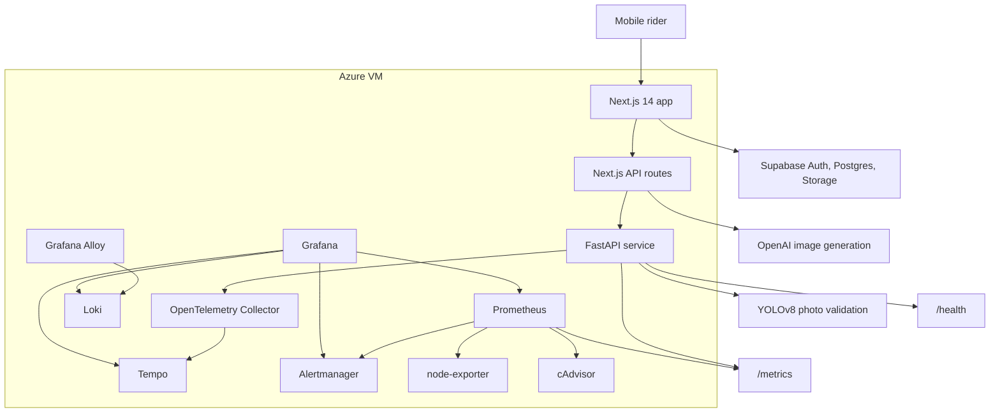
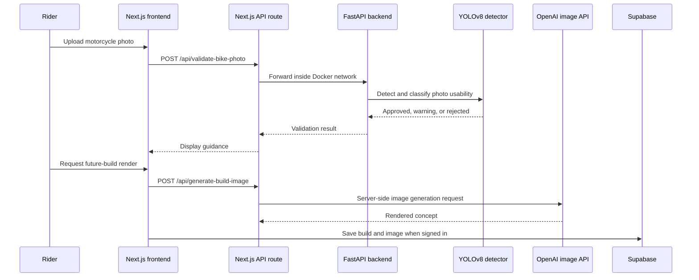
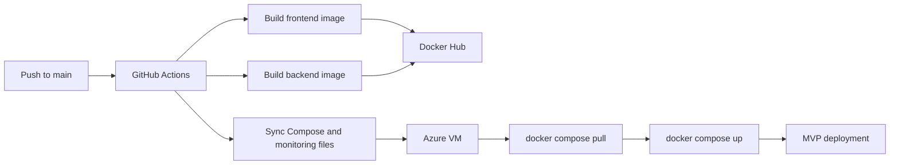

# SlowChrome Technical Case Study

This document is the deeper engineering companion to the recruiter-friendly [README](../README.md). It explains the architecture, deployment model, observability stack, security boundaries, and tradeoffs behind SlowChrome.

## System Overview

SlowChrome is an AI-powered motorcycle customization platform. The MVP combines a mobile-first product experience, motorcycle photo validation, server-side AI image generation, cloud-backed saved builds, and production-style deployment/observability.

## Product Workflow

## Engineering Highlights

| Area | Implementation |
| --- | --- |
| Frontend | Mobile-first Next.js product experience for style discovery, bike upload, build generation, saved builds, and explore feed. |
| Backend | FastAPI service validates uploaded motorcycle photos before the AI image workflow runs. |
| AI workflow | YOLOv8 gates photo quality before server-side OpenAI image generation. |
| Cloud garage | Supabase Auth, Postgres, Storage, and Row Level Security support account-owned saved builds. |
| Parts discovery | Product flow includes parts recommendations tied to the user's motorcycle and customization direction. |
| Explore feed | Biweekly customization news, style updates, and local motorcycle events are part of the platform direction. |
| Deployment | Frontend and backend are containerized separately and deployed to an Azure VM with Docker Compose. |
| CI/CD | GitHub Actions builds/pushes Docker images and deploys the stack. |
| Observability | Prometheus, Grafana, Loki, Tempo, OpenTelemetry, Alertmanager, node-exporter, and cAdvisor provide visibility into app and infrastructure health. |

## Deployment Flow

Current hardening targets:

- Deploy immutable commit-SHA tags instead of `latest`.
- Add post-deploy smoke tests.
- Document rollback to the previous known-good image.
- Move public traffic from raw VM port access to domain + HTTPS reverse proxy.

## Observability Stack

| Phase | Scope | Tools |
| --- | --- | --- |
| 1 | Backend golden signals | FastAPI metrics, Prometheus, Grafana |
| 2 | VM and container saturation | node-exporter, cAdvisor |
| 3 | Container logs | Loki, Grafana Alloy |
| 4 | Distributed tracing | OpenTelemetry, Collector, Tempo |
| 5 | Alerting | Prometheus rules, Alertmanager, Grafana alerting overview |

Dashboard coverage includes:

- Backend traffic by route.
- Backend 5xx rate.
- Backend p95 latency.
- Backend scrape health.
- VM CPU, memory, disk, and network utilization.
- Container CPU, memory, and restart signals.
- Frontend and backend logs.
- Backend traces for routes such as `/health`, `/metrics`, and photo validation.
- Firing and pending alerts by severity.

Operational note: monitoring services bind to localhost and are accessed through SSH tunnels instead of being exposed to the public internet.

## Security and Data Boundaries

| Boundary | Design choice |
| --- | --- |
| Backend exposure | FastAPI is reached through the frontend proxy and Docker network, not directly by the browser. |
| AI credentials | OpenAI API key stays server-side. |
| Supabase keys | Browser receives only public anonymous configuration. |
| User data | Builds and garage state are user-owned through Row Level Security policies. |
| Image storage | Private storage bucket with per-user path policies. |
| Operations access | Grafana, Prometheus, Loki, Tempo, and Alertmanager are intended for tunnelled access. |
| Public showcase | This repository excludes source code, `.env` files, private logs, tokens, and unredacted screenshots. |

## Troubleshooting Stories

### Backend uploads without a public backend

The browser needs to validate uploaded bike photos, but exposing FastAPI directly would create a wider public surface area. The current design sends browser traffic to a Next.js API route, then proxies to `http://backend:8000` inside Docker. The user flow stays simple while the backend port remains internal.

### Account-backed saves without cross-user data access

Cloud saves use Supabase Auth with user-owned tables, private storage, and Row Level Security. The design goal is that signed-in users can retrieve their own builds while database and storage policies prevent access to another user's saved images.

### Single-VM observability without public dashboards

For the MVP, the monitoring stack runs on the same VM as the app. Grafana, Prometheus, Loki, Tempo, and Alertmanager bind locally and are inspected through SSH tunnels. This keeps the system debuggable without publishing internal operations tools.

## Current Status

| Area | Status |
| --- | --- |
| Local app flow | Working for MVP development |
| Azure VM hosting | Working for MVP testing |
| Dockerized frontend/backend | Implemented |
| GitHub Actions deployment | Implemented |
| Supabase auth and cloud save code | Implemented |
| Deployed auth redirect | Needs domain/DNS follow-up |
| HTTPS/domain | Planned |
| Production smoke tests | Planned |
| Public demo assets | Planned |

## Roadmap

Near-term production hardening:

- [ ] Purchase and configure the production domain.
- [ ] Add HTTPS with Caddy or Nginx.
- [ ] Update Supabase redirect allowlists for the production domain.
- [ ] Remove public access to raw port `3000`.
- [ ] Verify login, cloud saves, and image generation end to end on the production domain.
- [ ] Add post-deploy smoke tests and rollback notes.

Portfolio enhancements:

- [ ] Add a two-minute product video.
- [ ] Add redacted Grafana dashboard screenshots.
- [ ] Add a polished architecture image.
- [ ] Add a short runbook or incident example.
- [ ] Add product screenshots or GIFs.

## Interview Talking Points

- How to keep a backend private while still supporting browser uploads.
- How to structure an AI workflow so validation happens before an expensive generation call.
- How Supabase Row Level Security changes the data model for user-owned builds.
- How to make a single-VM MVP observable without exposing operations dashboards.
- How to evolve the current deployment from raw VM port access to domain, HTTPS, reverse proxy, smoke tests, and rollback.
- What should move from prototype allowances to server-side entitlement enforcement before a paid launch.

