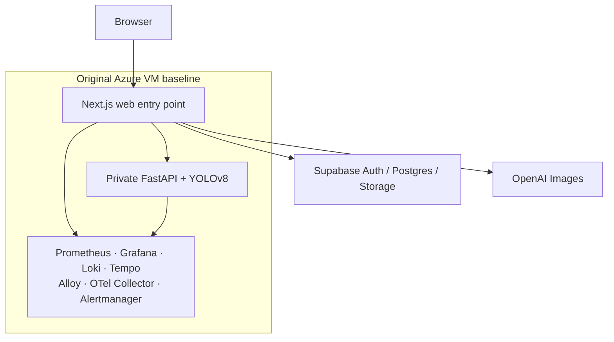
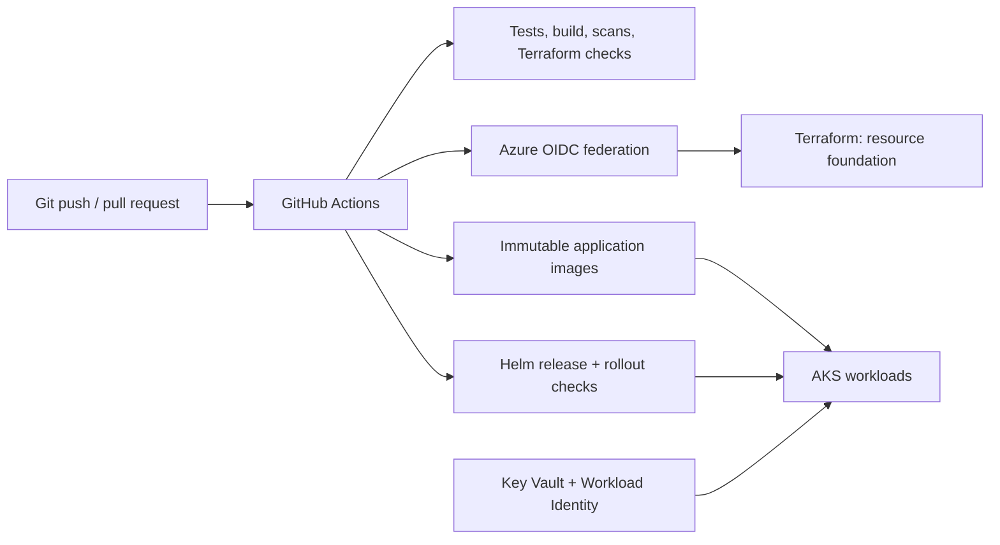
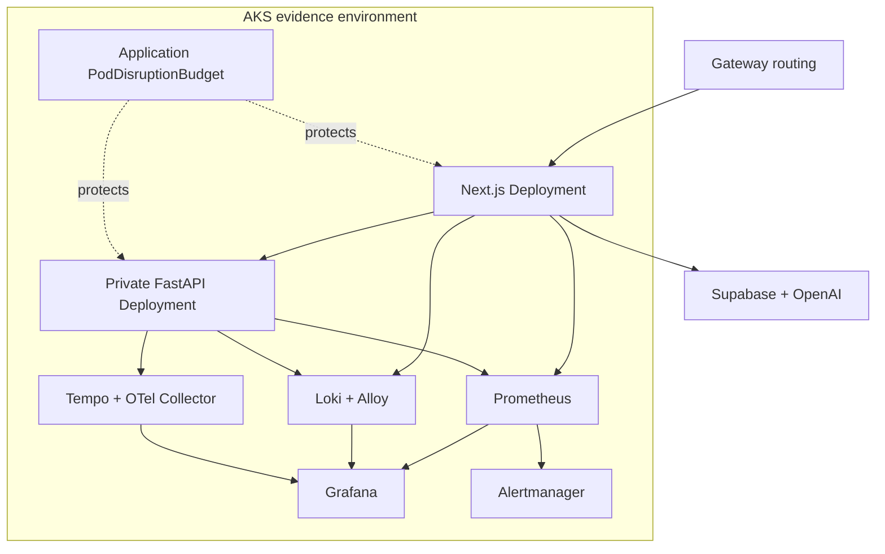

# SlowChrome: From a Single VM Baseline to AKS Operations Evidence

This case study documents the operational evolution of SlowChrome, an
AI-assisted motorcycle customization application. It is deliberately
evidence-led: a capability is described as implemented only when there is a
corresponding deployment, readiness check, drill record, or sanitized artifact.

Read the [portfolio overview](../README.md) for the recruiter-facing version.

> **Scope boundary:** the Azure VM was the original application baseline. The
> AKS environment was deployed and exercised in parallel as a time-boxed
> cloud-native evidence environment. This is not a claim that public DNS was
> cut over to AKS, that AKS served sustained production traffic, or that the VM
> was permanently retired.

## Executive Summary

| Area | Evidence | Status |
| --- | --- | --- |
| Product baseline | Next.js web app, private FastAPI/YOLO service, Supabase, and OpenAI Images on an Azure VM with Docker Compose | Implemented baseline |
| Infrastructure | Terraform-managed Azure foundation for the AKS environment | Implemented and exercised |
| Delivery identity | GitHub Actions authenticates to Azure with OIDC and deploys immutable images through Helm | Implemented and exercised |
| AKS runtime | Frontend and backend Deployments, readiness probes, PDB protection, and Gateway-based routing | Implemented and exercised |
| Observability | Prometheus, Grafana, Loki, Tempo, Alloy, OpenTelemetry Collector, and Alertmanager | Implemented and exercised |
| Recovery | Bad-readiness, Pod-loss, alert-pipeline, and node-drain exercises with recorded timestamps | Implemented and measured |
| Long-term production decision | DNS cutover, externally reachable TLS, paging integration, SLO window, Regular VM migration, and AKS teardown | Not claimed / separate work |

## 1. Product and Original Operational Boundary

SlowChrome lets a user upload a motorcycle image, validate whether the image is
suitable, configure a future build, request a bounded AI render, and save
user-owned state. The browser talks to a Next.js application; FastAPI and
YOLOv8 remain private behind server-side routes. Supabase provides identity,
Postgres, Row Level Security, and private object storage. OpenAI credentials
stay server-side.

The first runtime was intentionally small and understandable: Docker Compose on
an Azure Spot VM, with the application and an observability stack on the same
host. It allowed fast iteration, immutable image releases, and useful
troubleshooting, but it also concentrated application, monitoring, and host
failure in one place.

The system already had commit-derived images, GitHub Actions quality gates,
known-good deployment recovery, and private Grafana access. The cloud-native
phase was designed to add a separate operational control plane and to prove the
failure behavior that a single machine cannot demonstrate.

## 2. Why AKS Was a Parallel Evidence Environment

The AKS work was not a “convert Compose YAML to Kubernetes YAML” exercise. Its
purpose was to create inspectable evidence for a cloud-native operating model:

- infrastructure can be recreated from Terraform rather than console steps;
- CI can use short-lived cloud identity instead of a stored Azure secret;
- the application can be delivered as immutable Helm releases;
- logs, metrics, traces, dashboards, and alert flow work inside Kubernetes; and
- workload failures and planned node maintenance have measured outcomes.

Keeping the original VM as the baseline avoided conflating this evidence work
with a public cutover. It also preserved a simple known-good reference while
the AKS configuration, cluster permissions, observability components, and
recovery playbooks were tested.

## 3. AKS Foundation and Delivery

### Infrastructure as code

Terraform manages the Azure foundation used by the evidence environment,
including the AKS dependency chain and its deployment prerequisites. State,
resource names, subscription information, and provider configuration are
private. Terraform plans were produced and reviewed before applies; this is
important because the plan is the change contract, not merely a deployment
command.

### CI/CD identity and release path

GitHub Actions uses Azure OIDC federation for delivery. That replaces a
long-lived Azure client secret in CI with short-lived workload identity. The
workflow builds immutable frontend/backend images, publishes them to the
registry, and uses Helm to release a specific version to AKS. Kubernetes
readiness and rollout status are checked as deployment evidence.

The release path was also hardened with namespace-scoped delivery permissions
and a CRD permission preflight. Those changes made failed setup/recovery paths
visible early instead of failing after a partially applied release.

## 4. AKS Runtime Topology

The frontend and backend run as Kubernetes Deployments with readiness checks.
The backend remains private behind the frontend route boundary. The application
PodDisruptionBudget was verified before the node-drain exercise with one
voluntary disruption allowed; this makes planned maintenance an intentional
availability action rather than an unbounded eviction.

## 5. Kubernetes Observability

The AKS observability stack used five Helm releases and the following
components:

| Signal | Components | Question answered |
| --- | --- | --- |
| Metrics | Prometheus and Kubernetes/application exporters | Are workload health, errors, latency, and resource conditions changing? |
| Logs | Alloy and Loki | Which service or rollout emitted the relevant event? |
| Traces | OpenTelemetry Collector and Tempo | Where did a request spend time or fail? |
| Dashboards | Grafana | Can an operator correlate application, Pod, and cluster signals? |
| Alerts | Prometheus rules and Alertmanager | Did an alert rule transition and clear through the internal alert path? |

Prometheus, Loki, and Tempo each use bounded persistent storage (8 Gi, 8 Gi,
and 5 Gi respectively). Their services are `ClusterIP`; the observability
interfaces are not presented as public endpoints. This choice limits exposure
and cost while keeping the stack useful for an evidence environment.

### Evidence snapshots

The screenshots are static and sanitized. They are proof of the monitoring
surface, not a substitute for a public Grafana endpoint or an external
availability monitor.

### Integration lessons

Several issues were found and resolved while connecting the stack:

- an unsupported top-level OpenTelemetry metrics setting had to be removed;
- Prometheus discovery selectors had to match the actual application labels;
- Loki sidecar behavior needed an explicit integration contract; and
- non-root Alloy required writable state plus a ConfigMap checksum so config
  changes reliably caused rollout.

These are small configuration details with large operational effects: a green
Pod does not prove that telemetry is useful until the signals are discoverable,
queryable, and tied to the workload being changed.

## 6. Measured Recovery Exercises

Every measurement below is scoped to a controlled exercise in the AKS evidence
environment. It is not an SLO report and should not be generalized to a
long-running production workload.

| Exercise | Detection | Recovery / completion | Scope and interpretation |
| --- | ---: | ---: | --- |
| Invalid backend readiness configuration | 370 s | 383 s | A deliberately invalid readiness setting was surfaced, then rolled back until the backend became Ready. |
| Frontend Pod loss | 8 s | 9 s | A frontend Pod was removed; its Deployment restored desired state. |
| Backend Pod loss | 7 s | 14 s | A backend Pod was removed; its Deployment restored desired state. |
| Alert pipeline | 41 s | 345 s | A Prometheus rule transitioned through Alertmanager and cleared. The receiver was internal Alertmanager only—no email, Slack, or PagerDuty notification is claimed. |
| Workload-node drain | — | 15 s drain completion; 28 s controlled recovery | Planned maintenance with the PDB verified before and workload nodes returning to three afterward. This is not incident MTTD/MTTR. |

In the recorded node-drain timeline, the drain began at `03:25:24Z`, completed
at `03:25:39Z`, and the workload recovered at `03:25:52Z`. Frontend and backend
replicas were 2/2 Ready afterward; all 16 observability components were Ready;
no workload node remained cordoned; and the PDB reported no events.

The key distinction is language: a node drain is a controlled maintenance
operation. “Drain completion” and “controlled maintenance recovery” accurately
describe the measured outcome; calling it a detected incident would not.

## 7. Security and Cost Boundaries

| Boundary | Control / decision |
| --- | --- |
| Delivery identity | GitHub-to-Azure OIDC; no long-lived delivery secret is required in the workflow. |
| Application secrets | Azure Key Vault and workload identity are used without publishing values in this repository. |
| Network exposure | Backend and observability components are not documented as public endpoints. |
| Portfolio safety | No source code, Terraform state, kubeconfig, raw logs, IDs, IPs, tokens, or user data are included. |
| Cost control | The AKS environment is time-boxed. The short observability evidence window was estimated at roughly US$0.40 incremental cost; it is not presented as a long-term production bill. |

## 8. What Remains Before a Permanent Cutover

The project intentionally leaves these as separate decisions rather than
implying completion:

1. choose the long-term Regular VM or AKS runtime based on cost and operational
   needs;
2. if AKS becomes permanent, establish trusted public TLS and a controlled DNS
   cutover/rollback plan;
3. connect Alertmanager to an external notification receiver;
4. operate an SLO/SLI observation window before making availability claims;
5. complete backup/restore and broader failure testing; and
6. explicitly approve and execute AKS teardown once the evidence window closes.

## 9. Interview Discussion Guide

- Explain why a short-lived OIDC token is safer for CI than a stored cloud
  secret, and what RBAC it still requires.
- Walk through a failed Helm rollout: readiness signal, Kubernetes event/log
  checks, rollback, and post-recovery verification.
- Contrast application recovery after a Pod deletion with controlled node
  maintenance under a PodDisruptionBudget.
- Describe why ClusterIP-only observability is a security boundary, and what
  additional work is needed for independent external detection.
- Discuss the tradeoff between a cost-efficient VM baseline and a temporary AKS
  environment that provides cloud-native operating evidence.
