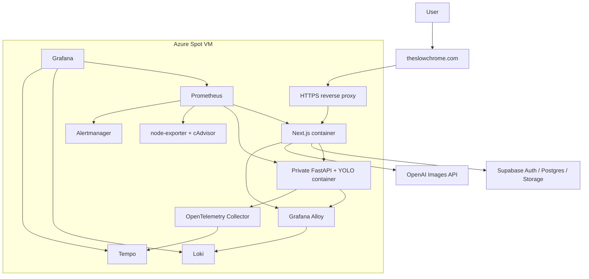
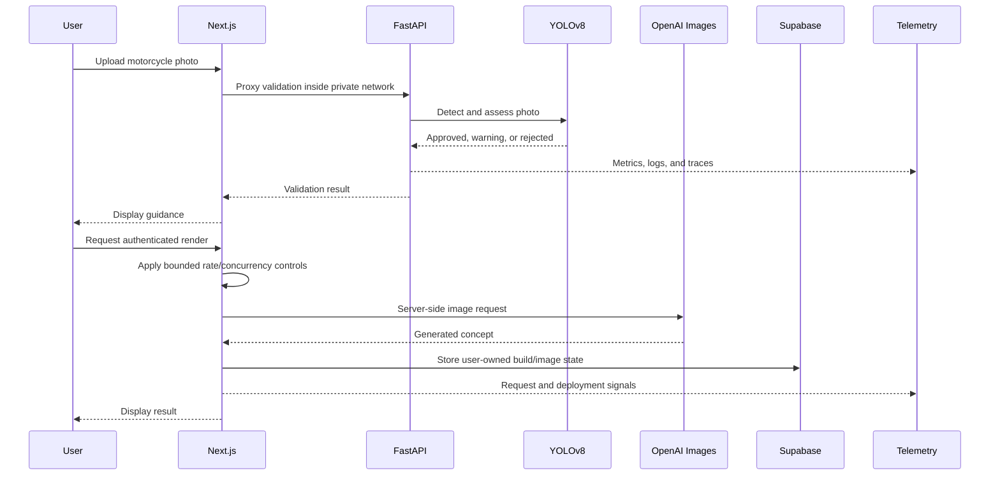
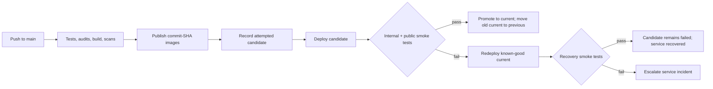
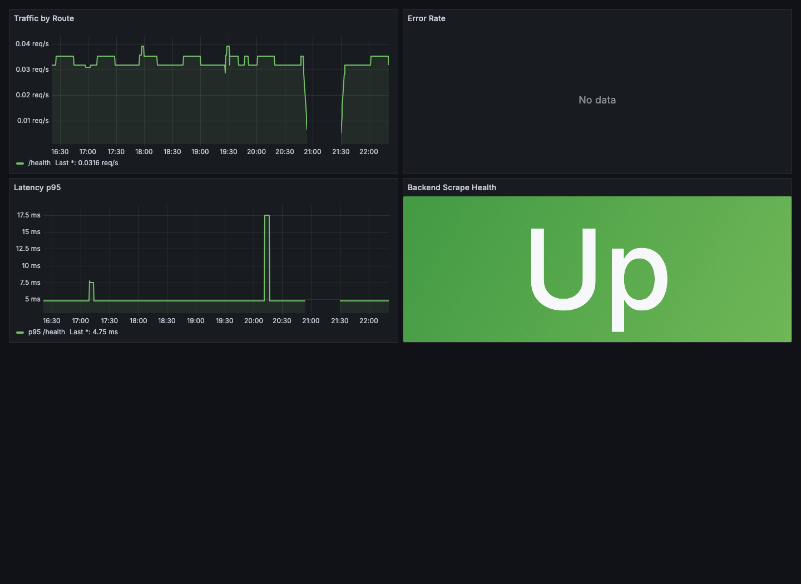
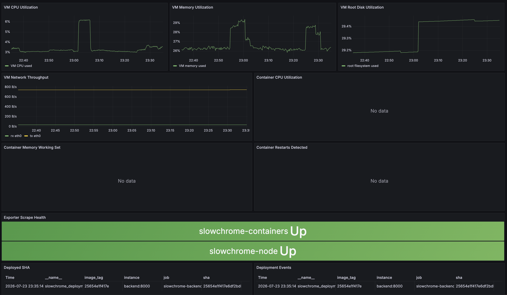
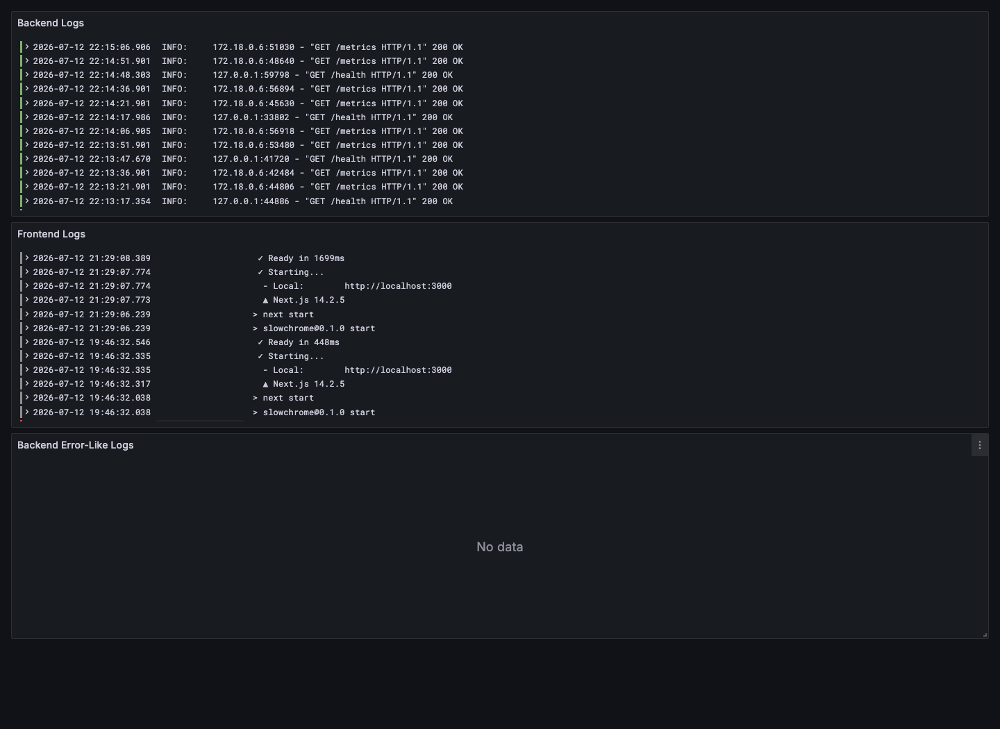
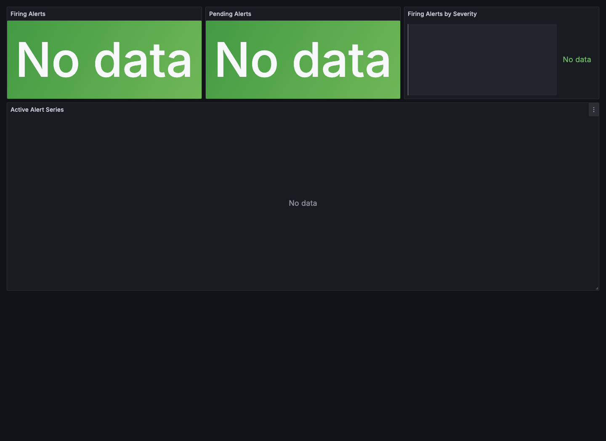
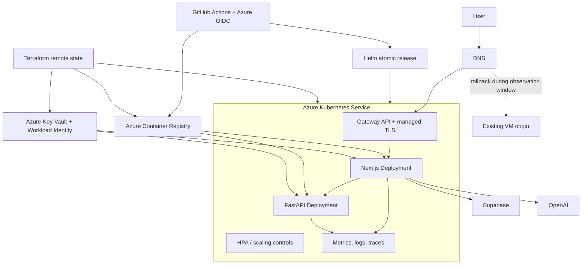

# SlowChrome SRE / DevOps Technical Case Study

SlowChrome is a live AI-assisted motorcycle customization application. This
case study examines the system around the product: delivery, recovery,
observability, security boundaries, operational limits, and the planned
migration from a single Azure VM to Azure Kubernetes Service (AKS).

The project is presented as an evidence trail rather than a list of tools:

- **Implemented and running** means the capability is present on the current
  production platform.
- **Implemented; external verification pending** means the code and deployment
  path exist, but a recorded production journey is still required.
- **Designed or planned** means there is an accepted design or implementation
  plan, but it is not claimed as production experience yet.

See the [portfolio overview](../README.md) for the shorter recruiter-facing
version.

## Executive Summary

| Area | Current evidence | Status |
| --- | --- | --- |
| Runtime | Live HTTPS application on an Azure Spot VM using Docker Compose | Implemented and running |
| Delivery | GitHub Actions quality gates, immutable commit-SHA images, smoke-tested deployment | Implemented and running |
| Recovery | Candidate/current/previous release state and automatic restoration of the known-good release | Implemented and running |
| Observability | Prometheus metrics, Loki logs, Tempo traces, Grafana dashboards, Alertmanager | Implemented and running |
| Security boundaries | Private FastAPI service, server-side secrets, Supabase RLS/private storage | Implemented; full user journey verification pending |
| Reliability program | SLI/SLO design, error-budget policy, external synthetics, and drill format | Designed; not production-verified |
| Cloud-native platform | Terraform-managed AKS, Helm, Azure OIDC, ACR, Key Vault, Gateway API | Planned; not yet deployed |
| Recovery evidence | Timestamped bad-deploy, Pod-loss, and node-drain measurements | Planned; not yet measured on AKS |

## 1. The System Being Operated

The product lets a user upload a motorcycle image, validate whether the photo
is suitable, configure a future build, request an authenticated bounded AI
render, and save garage/build state through Supabase.

The operationally important boundaries are:

- The browser reaches the public Next.js service over HTTPS.
- FastAPI and YOLOv8 remain private inside the container network.
- Next.js server routes broker privileged backend and OpenAI calls.
- Supabase provides authentication, Postgres, Row Level Security, and private
  object storage.
- Application and infrastructure telemetry remain private and are inspected
  through an SSH tunnel.

## 2. Current Production Architecture

This architecture is intentionally inexpensive and understandable, but the VM
is also one failure domain for the application, monitoring, and self-hosted
deployment runner. Because it is a Spot VM, platform eviction is an additional
availability risk.

## 3. Runtime Request Path

The render controls are currently process-local. Running multiple frontend
replicas would therefore multiply the effective limit. The frontend remains
single-replica until this coordination state is moved to a shared service such
as Redis or another durable control plane.

## 4. CI/CD and Release Recovery

### Quality and security gates

The GitHub Actions pipeline currently includes:

- frontend tests, `npm audit`, and a production Next.js build;
- a Playwright homepage visual sanity check;
- Python/backend and deployment-script tests;
- `pip-audit`;
- Terraform formatting and validation;
- frontend/backend container builds; and
- Trivy image scans.

Images are tagged with a commit-derived SHA and pushed before deployment.
Mutable `latest` is not accepted as a production release identity.

### Deployment state machine

The three release pointers have distinct meanings:

- `attempted`: the candidate currently being evaluated;
- `current`: the latest release that passed smoke tests; and
- `previous`: the successful release before `current`.

This prevents a failed candidate from overwriting the known-good pointer. If
candidate smoke tests fail, the deployment script automatically restores and
re-verifies `current`. The workflow still fails, preserving the evidence that
the candidate was defective. A separate manual rollback path can target
`previous` or an explicit immutable image tag.

Smoke tests cover the public HTTPS page, the local frontend, backend health, and
deployment identity. The release log makes a deployed workload traceable to a
Git commit and recovery outcome.

## 5. Failure Model

| Failure | Current detection/control | Residual gap |
| --- | --- | --- |
| Bad application release | CI gates, immutable candidate, public/internal smoke tests, automatic known-good restoration | Recovery time has not yet been captured as a formal drill metric |
| Frontend/backend process failure | Docker health checks, metrics, logs, alerts, restart policy | Both services still share one VM |
| Spot eviction or VM loss | Runbooks and reproducible Compose deployment | Application, telemetry, and self-hosted runner share the failed host |
| Disk pressure | node-exporter/cAdvisor signals, alerting, disk-full runbook | No independent telemetry plane if the host is unavailable |
| OpenAI or Supabase degradation | Application errors, latency signals, bounded AI requests | Third-party dependency objectives need calibrated SLIs |
| Monitoring-stack failure | Scrape health and component visibility while VM is reachable | Same-host monitoring cannot independently prove VM availability |
| Operator/configuration error | Version-controlled configuration, deploy tests, immutable images | Infrastructure is not yet fully Terraform-managed |

The central lesson is that application redundancy alone is insufficient when
the deployment runner, monitoring plane, and workload share one host.

## 6. Observability

| Signal | Implementation | Operational question |
| --- | --- | --- |
| Metrics | FastAPI/Next.js signals, Prometheus, node-exporter, cAdvisor | Is traffic, latency, error rate, or saturation abnormal? |
| Logs | Container stdout, Grafana Alloy, Loki | Which service and release produced the failure? |
| Traces | OpenTelemetry Collector and Tempo | Where did a request spend time or fail? |
| Dashboards | Grafana golden-signals, infrastructure, logs, alerts | What changed and how broad is the impact? |
| Alerts | Prometheus rules and Alertmanager | Which symptoms require operator action? |
| Release identity | Deployment info/timestamp metrics and release state | Which commit is live during the incident? |

Monitoring endpoints are not exposed publicly. The screenshots below are
static, redacted evidence captured through a private SSH tunnel.

### Backend golden signals

### Infrastructure saturation and deployment identity

### Centralized container logs

### Alert state

### Example investigation path

For a reported slow validation request:

1. Confirm the symptom and deployed SHA on the Grafana overview.
2. Compare request rate, 5xx rate, and p95 latency by route.
3. Check VM/container CPU and memory for saturation.
4. Filter Loki logs by backend service and the incident time window.
5. Follow a Tempo trace to separate proxy, FastAPI, model, and dependency time.
6. Correlate the first abnormal signal with the deployment event.

This path links a user-visible symptom to a release, service, host constraint,
or third-party dependency rather than treating dashboards as decoration.

## 7. Reliability Program: Designed, Not Yet Claimed

The reliability design proposes an initial 14-day measurement window and a
99.9% availability objective for the public application. AI-render success and
latency objectives will be calibrated from real traffic rather than invented
up front.

The planned program includes:

- externally hosted synthetic checks so VM failure remains observable;
- explicit availability, error, and latency SLIs;
- multi-window burn-rate alerting;
- an error-budget policy connected to release decisions;
- timestamped failure-drill templates; and
- MTTD plus MTTR/RTO reporting.

These are design targets, not production results. No SLO compliance percentage,
error-budget consumption, or measured recovery number is claimed until the
queries, external checks, and drill evidence exist.

## 8. Security and Data Boundaries

| Boundary | Control |
| --- | --- |
| Public entry | HTTPS domain routes only to the web entry point |
| Backend | FastAPI is reached through a Next.js server route, not a public browser endpoint |
| AI credentials | OpenAI credentials stay server-side and enter deployment through secrets |
| Authentication | Supabase Auth establishes user identity |
| Database | Row Level Security constrains account-owned records |
| Object storage | Private bucket and per-user paths protect generated assets |
| Operations surfaces | Grafana, Prometheus, Loki, Tempo, and Alertmanager remain private |
| Portfolio repository | Source, state, kubeconfig, environment files, tokens, private logs, and user data are excluded |

The production flow for login, cloud persistence, and authenticated rendering
is implemented, but a recorded end-to-end verification on the final domain is
still listed as required evidence.

## 9. Operational Artifacts

The private source repository contains:

- site-down, bad-deploy, disk-full, and release-management runbooks;
- deployment and manual rollback scripts;
- automated deployment-script tests;
- observability readiness and backup/restore checklists;
- CI/CD workflows and container definitions;
- SLO/error-budget design material; and
- the staged AKS migration design and implementation plan.

This public repository summarizes those artifacts without publishing sensitive
configuration or pretending that planned controls are already operational.

## 10. Engineering Tradeoffs

| Decision | Benefit | Cost / follow-up |
| --- | --- | --- |
| Single VM + Compose baseline | Low cost, fast iteration, easy end-to-end debugging | One host contains the workload, runner, and telemetry plane |
| Private FastAPI behind Next.js | Smaller public attack surface and server-side control | Adds a proxy hop and requires correlated telemetry |
| Immutable SHA images | Traceable releases and deterministic rollback targets | Requires explicit retention and state management |
| Automatic known-good recovery | A rejected candidate does not remain live | Recovery logic itself must be tested and observed |
| Same-host monitoring | Affordable, rich local diagnosis | Cannot independently observe total host loss |
| Single frontend replica | Preserves correctness of process-local AI limits | No horizontal availability until coordination state is externalized |
| Parallel AKS migration | Keeps a proven rollback origin during learning and cutover | Temporarily operates two platforms |

## 11. Planned AKS Target

The cloud-native phase is intended to add operational evidence, not merely
replace `docker compose up` with `kubectl apply`.

### Staged implementation

1. Package and test the application locally with Helm and kind.
2. Establish Terraform remote state and GitHub-to-Azure OIDC.
3. Provision ACR, Key Vault, AKS, identity, and supporting networking.
4. Add Gateway API, managed TLS, immutable images, and atomic delivery.
5. Reproduce metrics, logs, traces, dashboards, and deployment identity on AKS.
6. Run bad-deploy, Pod-loss, and node-drain drills with timestamped evidence.
7. Move DNS only after application, observability, and recovery gates pass.
8. Keep the VM origin available for an observed rollback window before
   retirement.

### Acceptance evidence

| Capability | Evidence required before claiming completion |
| --- | --- |
| Infrastructure as Code | Reviewable Terraform plan, remote state, and reproducible apply |
| Secretless CI/CD | GitHub OIDC authentication without long-lived Azure credentials |
| Kubernetes packaging | Helm lint/template tests and a successful kind deployment |
| AKS delivery | Immutable ACR image, atomic Helm release, rollout and public smoke evidence |
| Kubernetes observability | Metrics, logs, traces, events, dashboards, and deployed SHA |
| Bad-deploy recovery | Failed candidate, automatic rollback, service recovery, measured duration |
| Pod-loss recovery | Pod deletion timestamp, rescheduling, readiness restoration, measured duration |
| Node maintenance | Drain/eviction evidence, workload continuity or bounded recovery, measured duration |
| Production cutover | DNS change, stable observation window, and rehearsed VM rollback path |

AKS, Terraform-managed Azure infrastructure, and Kubernetes recovery metrics
remain explicitly **planned** at the time of this baseline.

## 12. Before/After Evidence Strategy

| Dimension | Pre-AKS baseline | Target post-AKS evidence |
| --- | --- | --- |
| Runtime | Compose services on one Spot VM | Declarative AKS workloads managed by Helm |
| Infrastructure | VM-oriented, partially scripted | Terraform-managed Azure resources and remote state |
| Delivery identity | Docker Hub commit-SHA images | ACR digests/SHA plus Kubernetes deployment identity |
| Deployment safety | Automatic known-good Compose recovery | Atomic Helm rollback plus measured recovery |
| Failure isolation | Single host | Pod and node failure domains |
| Availability signal | Same-host monitoring | External synthetics plus cluster/application telemetry |
| Operations evidence | Runbooks and dashboards | Timestamped Kubernetes drills with MTTD and MTTR/RTO |
| Cutover safety | Current production origin | Parallel origin, DNS cutover, and retained rollback window |

## 13. Current Gaps

- The production VM is interruptible and remains a single failure domain.
- Same-host monitoring cannot independently prove total-host availability.
- The signed-in cloud save/render journey needs recorded external verification.
- Backup/restore and failure drills need measured results.
- The SLO/error-budget design is not yet production-verified.
- Shared render-control state is required before horizontal frontend scaling.
- AKS and Terraform implementation has not started; the present evidence is the
  design, staged plan, and honest pre-migration baseline.

## 14. Interview Discussion Paths

- Trace a commit from CI gates to immutable image, candidate deployment, smoke
  decision, and automatic recovery.
- Use the Grafana evidence to investigate a latency or 5xx incident.
- Explain why same-host monitoring is useful but cannot be the availability
  authority.
- Discuss why process-local rate limiting blocks honest horizontal scaling.
- Compare a Compose rollback with an atomic Helm rollback and the evidence each
  should produce.
- Explain why the VM remains available during AKS DNS cutover.
- Identify which statements are current production facts, which need external
  verification, and which are future acceptance criteria.
