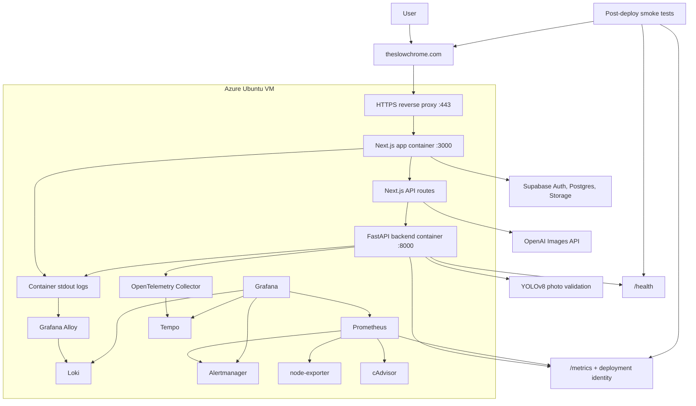
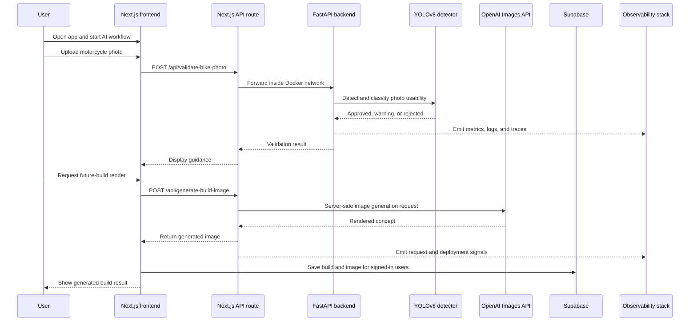
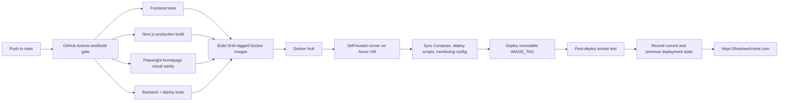
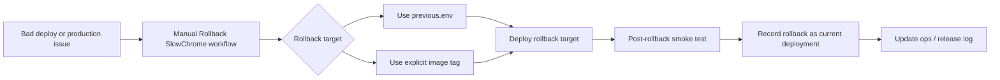

# SlowChrome SRE / DevOps Technical Case Study

This document is the deeper engineering companion to the recruiter-friendly [README](../README.md). It focuses on the operational layer around SlowChrome: HTTPS entry, containerized services, CI/CD, observability, rollback readiness, security boundaries, and production tradeoffs.

## System Overview

SlowChrome is the application being operated. This case study focuses on the production-style system around it: public HTTPS traffic enters through a reverse proxy, app services run as containers on an Azure VM, backend ports stay private, and the monitoring plane is accessed through SSH tunnels instead of public dashboards.

## Runtime Request Path

The main AI workflow is useful as an SRE view because it shows the public/private network boundary, where server-side credentials are used, and where app telemetry is produced.

## Operational Highlights

| Area | Implementation |
| --- | --- |
| Public entry | `https://theslowchrome.com` routes through an HTTPS reverse proxy to the internal app container. |
| Containerized services | Next.js and FastAPI run as separate Docker services with clear app/backend boundaries. |
| Private backend network | Browser traffic reaches FastAPI through a Next.js API route; the backend is not a public entry point. |
| CI/CD | GitHub Actions runs build/test gates, visual sanity checks, backend/deploy tests, Docker build/push, deploy, smoke test, and deployment-state recording. |
| Immutable releases | Production deploys use commit-derived short-SHA image tags instead of mutable `latest` tags. |
| Recovery | Manual rollback can restore the previous deployment state or an explicit image tag, then smoke-test and record the result. |
| Observability | Prometheus, Grafana, Loki, Tempo, OpenTelemetry, Alertmanager, node-exporter, and cAdvisor provide app, deployment, and infrastructure visibility. |
| Security boundaries | AI credentials stay server-side; Supabase Auth/RLS/private storage handle account-owned data. |

## Production Deployment Flow

Deployment controls:

- Production deploys use commit-derived short-SHA image tags, not `latest`.
- The deploy script refuses mutable `IMAGE_TAG=latest`.
- The deploy job passes production Supabase and OpenAI configuration through GitHub Actions secrets.
- Post-deploy smoke tests check the public HTTPS homepage, local frontend, backend health, and deployment identity metrics.
- Deployment state is recorded under `.runtime/deployments/current.env`, `previous.env`, and `history.log`.

## Rollback and Recovery Flow

Supporting runbooks cover site-down response, bad-deploy rollback, disk-full recovery, release logging, observability readiness, and backup/restore readiness.

## Observability Stack

| Phase | Scope | Tools |
| --- | --- | --- |
| 1 | Backend golden signals | FastAPI metrics, Prometheus, Grafana |
| 2 | VM and container saturation | node-exporter, cAdvisor |
| 3 | Container logs | Loki, Grafana Alloy |
| 4 | Distributed tracing | OpenTelemetry, Collector, Tempo |
| 5 | Alerting | Prometheus rules, Alertmanager, Grafana alerting overview |
| Release visibility | Deployment identity and release state | `slowchrome_deployment_info`, deployment timestamp metrics, Grafana deployed SHA and deployment events panels |

Dashboard and signal coverage includes:

- Backend traffic by route.
- Backend 5xx rate.
- Backend p95 latency.
- Backend scrape health.
- VM CPU, memory, disk, and network utilization.
- Container CPU, memory, and restart signals.
- Frontend and backend logs.
- Backend traces for routes such as `/health`, `/metrics`, and photo validation.
- Firing and pending alerts by severity.
- Deployed SHA and deployment event visibility.

Operational note: monitoring services bind to localhost and are accessed through SSH tunnels instead of being exposed to the public internet.

## Observability Evidence

The screenshots below were captured from the SlowChrome Grafana instance through a local SSH tunnel on July 12, 2026. They are static, portfolio-safe evidence of the monitoring stack; the live operations dashboards remain private.

| Dashboard | What it demonstrates |
| --- | --- |
| Backend Golden Signals | Traffic, error-rate panel, p95 latency, and FastAPI scrape health. |
| Infrastructure Saturation | VM CPU, memory, disk, network, exporter health, and deployment identity panels. |
| Container Logs | Loki-backed container log search through Grafana. |
| Alerting Overview | Prometheus/Grafana alert visibility for firing and pending alert states. |

### Backend Golden Signals

### Infrastructure Saturation

### Container Logs

### Alerting Overview

## Security and Data Boundaries

| Boundary | Design choice |
| --- | --- |
| Public web entry | Production traffic enters through `https://theslowchrome.com`. |
| Container ports | Frontend `3000` is local/internal; backend `8000` is Docker-network-only. |
| Backend exposure | Browser calls a Next.js API route, which proxies to FastAPI inside the Docker network. |
| AI credentials | OpenAI API key stays server-side and is passed through deployment secrets. |
| Supabase keys | Browser receives only public anonymous configuration. |
| User data | Builds and garage state are user-owned through Row Level Security policies. |
| Image storage | Private storage bucket with per-user path policies. |
| Operations access | Grafana, Prometheus, Loki, Tempo, and Alertmanager are intended for tunnelled access. |
| Public showcase | This repository excludes source code, `.env` files, private logs, tokens, and unredacted screenshots. |

## Engineering Tradeoffs

| Decision | Why it matters |
| --- | --- |
| Keep FastAPI private behind a Next.js API proxy | Browser uploads can reach the validation workflow without exposing the backend as a public internet service. |
| Use short-SHA image tags instead of `latest` | Each deploy maps back to a specific commit, which makes smoke tests, rollback, and incident review concrete. |
| Run monitoring on the same VM, accessed by SSH tunnel | The MVP stays inexpensive and debuggable while keeping Grafana, Prometheus, Loki, Tempo, and Alertmanager off the public internet. |
| Add Playwright visual sanity to the deploy gate | A lightweight homepage screenshot check catches blank-page and major layout regressions before images are promoted. |

## Production Readiness

| Area | State |
| --- | --- |
| Public web entry | Live at `https://theslowchrome.com` behind HTTPS reverse proxy. |
| App deployment | Frontend/backend are Dockerized and deployed with immutable short-SHA image tags. |
| CI/CD safety | GitHub Actions runs build/test gates, visual sanity, deploy, post-deploy smoke checks, and deployment-state recording. |
| Recovery | Manual rollback workflow can restore the previous deployment state or an explicit image tag. |
| Observability | Grafana dashboards cover backend golden signals, VM/container saturation, logs, traces, alerts, and deployment identity. |
| Remaining production hardening | End-to-end login/cloud-save/image-generation verification, TLS renewal drill, SSH/firewall tightening, and baseline security headers. |

## Next Improvements

- Verify the full signed-in production flow on the final domain: login, cloud saves, and image generation.
- Run and document the first rollback drill after multiple SHA-tagged deploys exist.
- Add GitHub Actions screenshots and a short product walkthrough video to the showcase.
