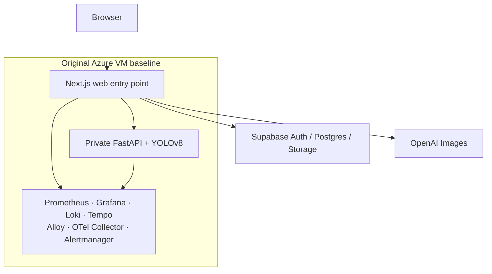
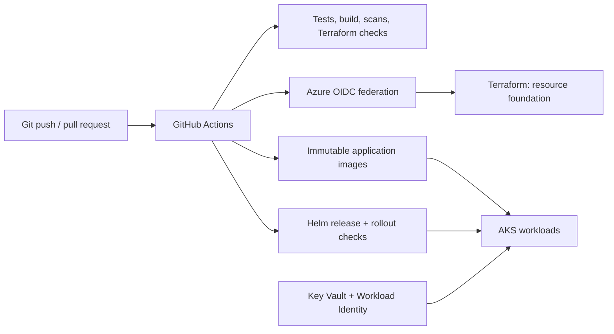
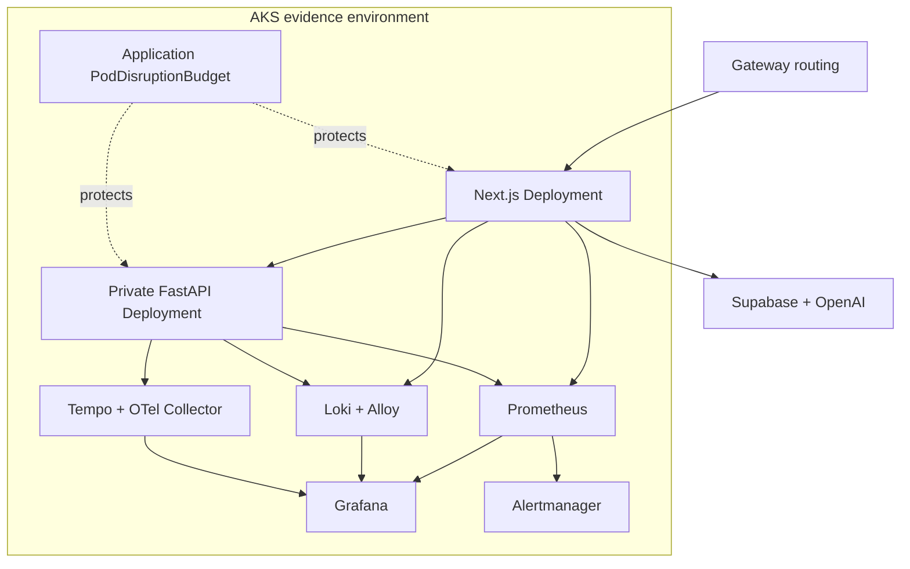

# SlowChrome: From a Single VM Baseline to AKS Operations Evidence

This case study documents the operational evolution of SlowChrome, an
AI-assisted motorcycle customization application. SlowChrome currently serves
its public application from an Azure Regular VM. The case study covers the move
to that stable production baseline and a separate, time-boxed AKS evidence
environment used to build and validate cloud-native delivery, observability,
and recovery practices.

It is deliberately evidence-led: a capability is described as implemented only
when there is a corresponding deployment, readiness check, controlled drill, or
sanitized artifact.

Read the [portfolio overview](../README.md) for the recruiter-facing version.

> **Scope:** AKS was deployed and exercised in parallel, but did not receive
> public production traffic. The current operating decision is to keep the
> application on the Regular VM, whose cost and operational profile better fit
> its present needs. AKS is paused as documented operations evidence, not as a
> pending public cutover.

## Executive Summary

| Area | Evidence | Status |
| --- | --- | --- |
| Current production runtime | Public application runs on an Azure Regular VM with Docker Compose and the VM observability stack | Current production |
| AKS foundation | Terraform-managed Azure foundation for the evidence environment | Implemented and exercised |
| AKS delivery | GitHub Actions authenticates to Azure with OIDC and deploys immutable images through Helm | Implemented and exercised |
| AKS operations | Frontend/backend Deployments, readiness probes, observability, and controlled resilience drills | Implemented and exercised |
| Operating decision | The Regular VM remains the proportionate long-term runtime for current product needs | Decided |
| AKS lifecycle | Any return to service or teardown requires a separate cost and lifecycle decision | Deferred |

## 1. Product and Current Production Boundary

SlowChrome lets a user upload a motorcycle image, validate whether the image is
suitable, configure a future build, request a bounded AI render, and save
user-owned state. The browser talks to a Next.js application; FastAPI and
YOLOv8 remain private behind server-side routes. Supabase provides identity,
Postgres, Row Level Security, and private object storage. OpenAI credentials
stay server-side.

The current public runtime is intentionally small and understandable: Docker
Compose on an Azure Regular VM, with the application and an observability stack
on the same host. It supports fast iteration, immutable image releases, and
useful troubleshooting, while concentrating application, monitoring, and host
failure in one place.

The system has commit-derived images, GitHub Actions quality gates, known-good
deployment recovery, and private Grafana access. The AKS work did not replace
the production VM; it created a separate operating environment for validating
managed Kubernetes delivery and failure behavior.

## 2. Why AKS Was a Parallel Evidence Environment

The AKS work was not a “convert Compose YAML to Kubernetes YAML” exercise.
Local Kubernetes practice began in Minikube, where manifests, Helm behavior,
and failure scenarios could be explored without cloud cost. The short AKS
window then validated the operating model against managed Azure services: cloud
identity, container-registry access, Gateway routing, managed node pools,
observability, and cost-aware lifecycle decisions.

Its purpose was to create inspectable evidence for a cloud-native operating
model:

- infrastructure can be recreated from Terraform rather than console steps;
- CI can use short-lived cloud identity instead of a stored Azure secret;
- the application can be delivered as immutable Helm releases;
- logs, metrics, traces, dashboards, and alert flow work inside Kubernetes; and
- workload failures and planned node maintenance can be exercised in a managed
  cluster.

Keeping the Regular VM in production avoided conflating this evidence work with
a public cutover. It preserved a known-good production reference while AKS
configuration, cluster permissions, observability components, and recovery
playbooks were tested.

## 3. AKS Foundation and Delivery

### Infrastructure as code

Terraform manages the Azure foundation used by the evidence environment,
including the AKS dependency chain and its deployment prerequisites. State,
resource names, subscription information, and provider configuration are
private. Terraform plans were produced and reviewed before applies; this is
important because the plan is the change contract, not merely a deployment
command.

### CI/CD identity and release path

GitHub Actions uses Azure OIDC federation for delivery. That replaces a
long-lived Azure client secret in CI with short-lived workload identity. The
workflow builds immutable frontend/backend images, publishes them to the
registry, and uses Helm to release a specific version to AKS. Kubernetes
readiness and rollout status are checked as deployment evidence.

The release path was also hardened with namespace-scoped delivery permissions
and a CRD permission preflight. Those changes made failed setup/recovery paths
visible early instead of failing after a partially applied release.

## 4. AKS Runtime Topology

Frontend and backend ran with two replicas and readiness probes, so a
replacement Pod had to become Ready before it could serve traffic. The backend
remained private behind the frontend route boundary. Before the planned
node-drain exercise, the PodDisruptionBudget was verified to allow at most one
voluntary disruption at a time, reducing the chance that routine maintenance
would evict both replicas together.

## 5. Kubernetes Observability

The AKS observability stack used five Helm releases and the following
components:

| Signal | Components | Operational use |
| --- | --- | --- |
| Metrics | Prometheus and Kubernetes/application exporters | Track workload health, errors, latency, and resource conditions. |
| Logs | Alloy and Loki | Investigate events from a service or rollout. |
| Traces | OpenTelemetry Collector and Tempo | Follow request paths through the application. |
| Dashboards | Grafana | View application, Pod, and cluster signals together. |
| Alerts | Prometheus rules and Alertmanager | Evaluate and route internal alert state changes. |

Prometheus, Loki, and Tempo each use bounded persistent storage (8 Gi, 8 Gi,
and 5 Gi respectively). Their services are `ClusterIP`; the observability
interfaces are not presented as public endpoints. This choice limits exposure
and cost while keeping the stack useful for an evidence environment.

### Evidence snapshots

*AKS operations dashboard showing replica availability, restarts, application
resource use, scrape health, readiness, and autoscaling signals.*

The screenshot is static and sanitized. It demonstrates the monitoring
surface, not a substitute for a public Grafana endpoint or an external
availability monitor.

### Integration lessons

Several issues were found and resolved while connecting the stack:

- an unsupported top-level OpenTelemetry metrics setting had to be removed;
- Prometheus discovery selectors had to match the actual application labels;
- Loki sidecar behavior needed an explicit integration contract; and
- non-root Alloy required writable state plus a ConfigMap checksum so config
  changes reliably caused rollout.

These are small configuration details with large operational effects: a green
Pod does not prove that telemetry is useful until the signals are discoverable,
queryable, and tied to the workload being changed.

## 6. Recovery and Resilience Drills

To validate how the AKS operating model behaved under controlled disruption, I
ran drills covering invalid readiness configuration, Pod replacement, internal
alert flow, and planned node maintenance. These drills validate Kubernetes and
Helm recovery behavior after a controlled trigger; they are not production
incidents or operator-response measurements.

| Drill | What was validated |
| --- | --- |
| Invalid backend readiness configuration | Helm rejected the invalid rollout and restored the known-good backend revision. |
| Frontend Pod loss | A controlled Pod deletion triggered Deployment self-healing; frontend capacity and external health were restored. |
| Backend Pod loss | A controlled Pod deletion triggered Deployment self-healing; backend readiness and external health were restored. |
| Internal alert flow | A Prometheus rule transitioned through Alertmanager and later cleared. |
| Planned workload-node drain | A PDB-aware drain rescheduled workloads and restored the expected healthy application state. |

## 7. Security and Cost Decisions

| Boundary | Control / decision |
| --- | --- |
| Delivery identity | GitHub-to-Azure OIDC; no long-lived delivery secret is required in the workflow. |
| Application secrets | Azure Key Vault and workload identity are used without publishing values in this repository. |
| Network exposure | Backend and observability components are not documented as public endpoints. |
| Portfolio safety | No source code, Terraform state, kubeconfig, raw logs, IDs, IPs, tokens, or user data are included. |
| Cost and lifecycle | AKS was time-boxed and paused after the evidence window; the Regular VM avoids operating managed Kubernetes capacity that current product needs do not justify. |

## 8. Current Operating Decision

SlowChrome currently runs on the Azure Regular VM. The AKS work remains
documented as a cloud-native operations exercise, not as a pending production
cutover. If product scale, availability requirements, or team operating needs
change, AKS can be reconsidered through a new cost, reliability, and migration
review.
