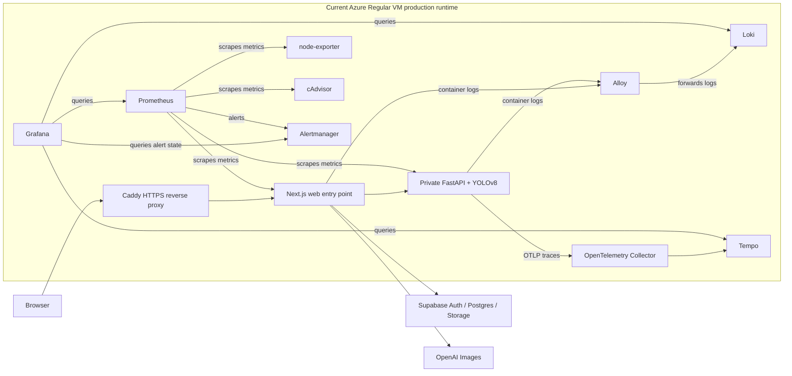
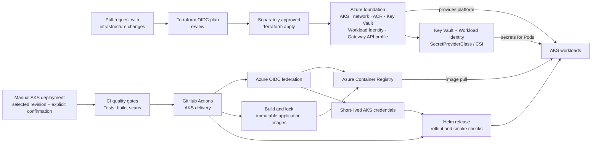
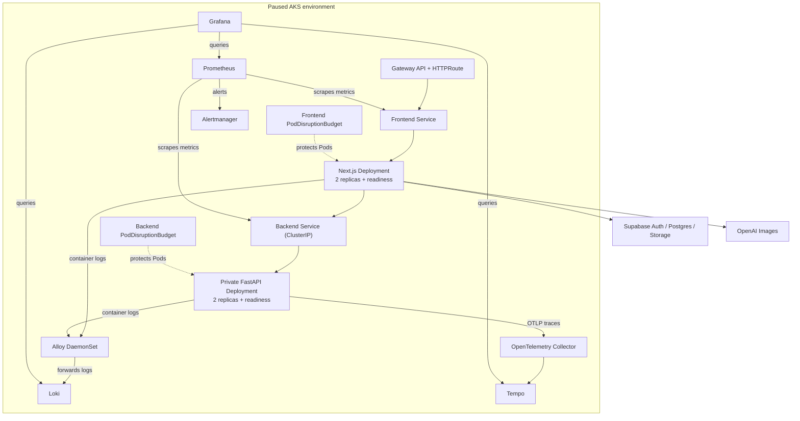
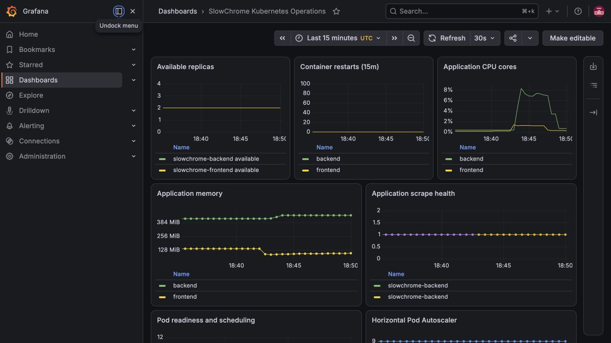

# SlowChrome: Operating a Product MVP on Azure and Exercising AKS

SlowChrome’s public product currently runs on an Azure Regular VM. This case
study explains that production operating model and a separate, time-boxed AKS
environment used to practice and validate cloud-native delivery, observability,
and resilience workflows.

It focuses on the engineering choices behind both environments: how they were
delivered, operated, observed, and deliberately bounded. The AKS environment
was exercised in parallel, did not receive public production traffic, and is
now paused while the Regular VM remains the current product runtime.

## 1. Current Production Architecture

SlowChrome lets riders upload a motorcycle image, validate whether it is
suitable, configure a future build, request a bounded AI render, and save
user-owned state. The browser reaches the Next.js application through Caddy;
FastAPI and YOLOv8 remain private behind server-side routes. Supabase provides
identity, Postgres, Row Level Security, and private object storage. OpenAI
credentials stay server-side.

The current public runtime is intentionally small and understandable: Docker
Compose on an Azure Regular VM, with the application and observability stack on
the same host. It supports fast iteration, immutable image releases, and useful
troubleshooting, while concentrating application, monitoring, and host failure
in one place.

```mermaid
flowchart LR
    browser["Browser"] --> proxy["Caddy HTTPS reverse proxy"]

    subgraph vm["Current Azure Regular VM production runtime"]
        proxy --> web["Next.js web entry point"]
        web --> backend["Private FastAPI + YOLOv8"]

        prom["Prometheus"] -->|scrapes metrics| web
        prom -->|scrapes metrics| backend
        prom -->|scrapes metrics| node["node-exporter"]
        prom -->|scrapes metrics| cadvisor["cAdvisor"]
        web -->|container logs| alloy["Alloy"]
        backend -->|container logs| alloy
        alloy -->|forwards logs| loki["Loki"]
        backend -->|OTLP traces| otel["OpenTelemetry Collector"]
        otel --> tempo["Tempo"]
        grafana["Grafana"] -->|queries| prom
        grafana -->|queries| loki
        grafana -->|queries| tempo
        grafana -->|queries alert state| alertmanager["Alertmanager"]
        prom -->|alerts| alertmanager
    end

    web --> supabase["Supabase Auth / Postgres / Storage"]
    web --> openai["OpenAI Images"]
```

*Figure 1 — Current production architecture. Public traffic reaches Caddy on
the Azure Regular VM; application services, host/container exporters, and the
observability stack run on the same host.*

The system has commit-derived images, GitHub Actions quality gates, known-good
deployment recovery, and private Grafana access. The AKS work did not replace
this production VM; it created a separate operating environment for validating
managed Kubernetes delivery and failure behavior.

## 2. Why AKS Was a Parallel Learning Environment

The AKS work was not a “convert Compose YAML to Kubernetes YAML” exercise.
Local Kubernetes practice began in Minikube, where manifests, Helm behavior,
and failure scenarios could be explored without cloud cost. The short AKS
window then validated the operating model against managed Azure services: cloud
identity, container-registry access, Gateway routing, managed node pools,
observability, and cost-aware lifecycle decisions.

Its purpose was to exercise a cloud-native operating model in a managed
environment:

- infrastructure can be recreated from Terraform rather than console steps;
- CI can use short-lived cloud identity instead of a stored Azure secret;
- the application can be delivered as immutable Helm releases;
- logs, metrics, traces, dashboards, and alert flow work inside Kubernetes; and
- workload failures and planned node maintenance can be exercised in a managed
  cluster.

Keeping the Regular VM in production avoided conflating this learning and
operations work with a public cutover. It preserved a known-good production
reference while AKS configuration, cluster permissions, observability
components, and recovery playbooks were tested.

## 3. AKS Infrastructure and Release Path

```mermaid
flowchart LR
    pr["Pull request with\ninfrastructure changes"] --> plan["Terraform OIDC plan\nreview"]
    plan --> apply["Separately approved\nTerraform apply"]
    apply --> foundation["Azure foundation\nAKS · network · ACR · Key Vault\nWorkload Identity · Gateway API profile"]

    dispatch["Manual AKS deployment\nselected revision + explicit confirmation"] --> checks["CI quality gates\nTests, build, scans"]
    checks --> deploy["GitHub Actions\nAKS delivery"]
    deploy --> oidc["Azure OIDC federation"]
    oidc --> acr["Azure Container Registry"]
    oidc --> credentials["Short-lived AKS credentials"]
    deploy --> images["Build and lock\nimmutable application images"]
    images --> acr
    acr -->|image pull| workloads["AKS workloads"]
    deploy --> helm["Helm release\nrollout and smoke checks"]
    credentials --> helm
    helm --> workloads
    foundation -->|provides platform| workloads
    foundation --> secrets["Key Vault + Workload Identity\nSecretProviderClass / CSI"]
    secrets -->|secrets for Pods| workloads
```

*Figure 2 — AKS infrastructure and release path. Terraform provisions the
Azure platform; an explicitly confirmed GitHub Actions workflow releases the
selected application revision into that platform.*

### Terraform-managed foundation

Terraform defined the Azure foundation for the AKS environment:
network dependencies, AKS, Azure Container Registry, Key Vault, workload
identity, and the Gateway API profile. Infrastructure changes began with an
OIDC-backed Terraform plan on a pull request and proceeded only through a
separately approved apply. State, resource names, subscription information, and
provider configuration remain private.

### Release workflow and workload identity

AKS deployment was deliberately manual: a workflow dispatch required explicit
confirmation before it could change the AKS environment. It first ran the
project quality gate, then used GitHub OIDC to sign in to Azure, built and
locked immutable frontend and backend images in ACR, obtained short-lived AKS
credentials, and released the selected image version through Helm. Rollout and
smoke checks verified the release path before it was treated as successful.

The delivery workflow used namespace-scoped permissions and a CRD permission
preflight, so missing access or setup was surfaced before a partially applied
release became an operational problem.

## 4. AKS Runtime Topology

```mermaid
flowchart TD
    subgraph cluster["Paused AKS environment"]
        gateway["Gateway API + HTTPRoute"] --> frontendSvc["Frontend Service"]
        frontendSvc --> frontend["Next.js Deployment\n2 replicas + readiness"]
        frontend --> backendSvc["Backend Service (ClusterIP)"]
        backendSvc --> backend["Private FastAPI Deployment\n2 replicas + readiness"]

        frontend
        backend
        frontendPdb["Frontend PodDisruptionBudget"]
        backendPdb["Backend PodDisruptionBudget"]
        prom["Prometheus"]
        grafana["Grafana"]
        alloy["Alloy DaemonSet"]
        loki["Loki"]
        collector["OpenTelemetry Collector"]
        tempo["Tempo"]
        am["Alertmanager"]
        frontendPdb -. protects Pods .-> frontend
        backendPdb -. protects Pods .-> backend
        prom -->|scrapes metrics| frontendSvc
        prom -->|scrapes metrics| backendSvc
        frontend -->|container logs| alloy
        backend -->|container logs| alloy
        alloy -->|forwards logs| loki
        backend -->|OTLP traces| collector
        collector --> tempo
        grafana -->|queries| prom
        grafana -->|queries| loki
        grafana -->|queries| tempo
        prom -->|alerts| am
    end
    frontend --> supabase["Supabase Auth / Postgres / Storage"]
    frontend --> openai["OpenAI Images"]
```

*Figure 3 — AKS runtime topology. The Gateway routes to the frontend; the
backend remains private, while Kubernetes workload protection and telemetry
operate inside the paused AKS environment.*

Frontend and backend ran with two replicas and readiness probes, so a
replacement Pod had to become Ready before it could serve traffic. The backend
remained private behind the frontend route boundary. Before the planned
node-drain exercise, the PodDisruptionBudget was verified to allow at most one
voluntary disruption at a time, reducing the chance that routine maintenance
would evict both replicas together.

## 5. Kubernetes Observability

The AKS observability stack used five Helm releases and the following
components:

| Signal | Components | Operational use |
| --- | --- | --- |
| Metrics | Prometheus and Kubernetes/application exporters | Track workload health, errors, latency, and resource conditions. |
| Logs | Alloy and Loki | Investigate events from a service or rollout. |
| Traces | OpenTelemetry Collector and Tempo | Follow request paths through the application. |
| Dashboards | Grafana | View application, Pod, and cluster signals together. |
| Alerts | Prometheus rules and Alertmanager | Evaluate and route internal alert state changes. |

Prometheus, Loki, and Tempo each use bounded persistent storage (8 Gi, 8 Gi,
and 5 Gi respectively). Their services are `ClusterIP`; the observability
interfaces are not presented as public endpoints. This choice limits exposure
and cost while keeping the stack useful during the AKS operating window.

### Dashboard snapshot

*Figure 4 — AKS operations dashboard. Sanitized static snapshot showing replica
availability, restarts, application resource use, scrape health, readiness, and
autoscaling signals.*

### Operational integration notes

Several implementation details had to be resolved before the stack became
useful for operations:

- Prometheus discovery selectors had to match the application labels actually
  applied by the Helm chart;
- OpenTelemetry and Loki integration required an explicit configuration
  contract rather than chart defaults alone; and
- non-root Alloy required writable state plus a ConfigMap checksum so its
  configuration changes reliably caused rollout.

These details turned installed components into usable signals: a green Pod does
not prove that telemetry is discoverable, queryable, and tied to the workload
being changed.

## 6. Recovery and Resilience Drills

To validate how the AKS operating model behaved under controlled disruption, I
ran drills covering invalid readiness configuration, Pod replacement, internal
alert flow, and planned node maintenance. They show automated platform behavior
after controlled triggers, not production incidents or manual incident-response
exercises.

| Drill | What was validated |
| --- | --- |
| Invalid backend readiness configuration | Helm rejected the invalid rollout and restored the known-good backend revision. |
| Frontend Pod loss | A controlled Pod deletion triggered Deployment self-healing; frontend capacity and external health were restored. |
| Backend Pod loss | A controlled Pod deletion triggered Deployment self-healing; backend readiness and external health were restored. |
| Internal alert flow | A Prometheus rule transitioned through Alertmanager and later cleared. |
| Planned workload-node drain | A PDB-aware drain rescheduled workloads and restored the expected healthy application state. |

## 7. Operating Boundaries and Current Decision

| Boundary | Control / decision |
| --- | --- |
| Delivery identity | GitHub-to-Azure OIDC; no long-lived delivery secret is required in the workflow. |
| Application secrets | Azure Key Vault and workload identity are used without publishing values in this repository. |
| Network exposure | Backend and observability components are not documented as public endpoints. |
| Cost and lifecycle | AKS was time-boxed and paused after the AKS operating window; the Regular VM avoids operating managed Kubernetes capacity that current product needs do not justify. |

SlowChrome currently runs on the Azure Regular VM. The AKS work remains
documented as a cloud-native operations exercise, not as a pending production
cutover. If product scale, availability requirements, or team operating needs
change, AKS can be reconsidered through a new cost, reliability, and migration
review.
