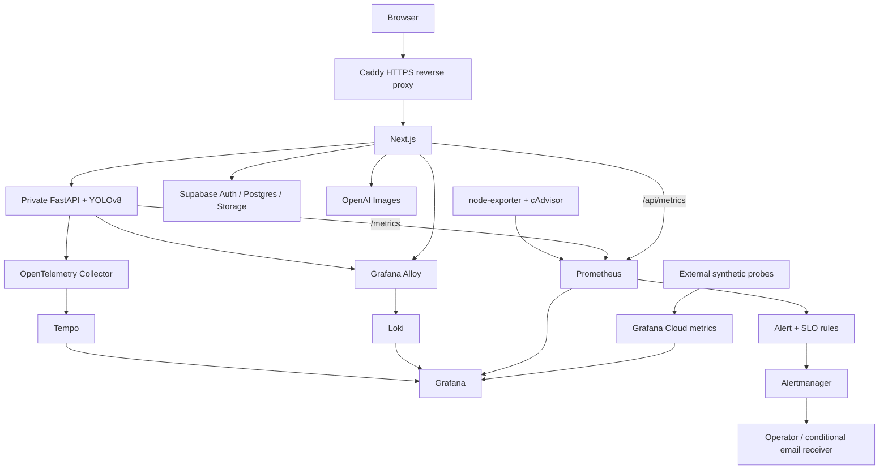
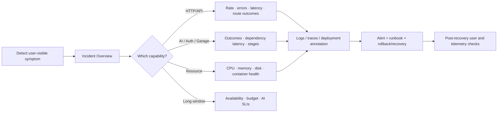
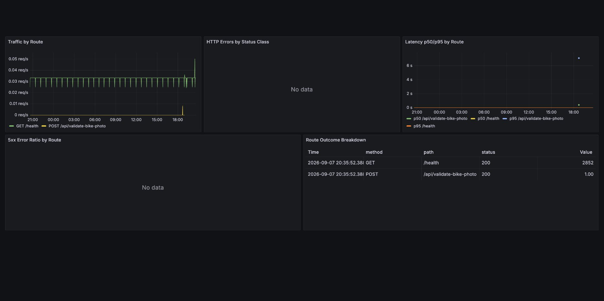
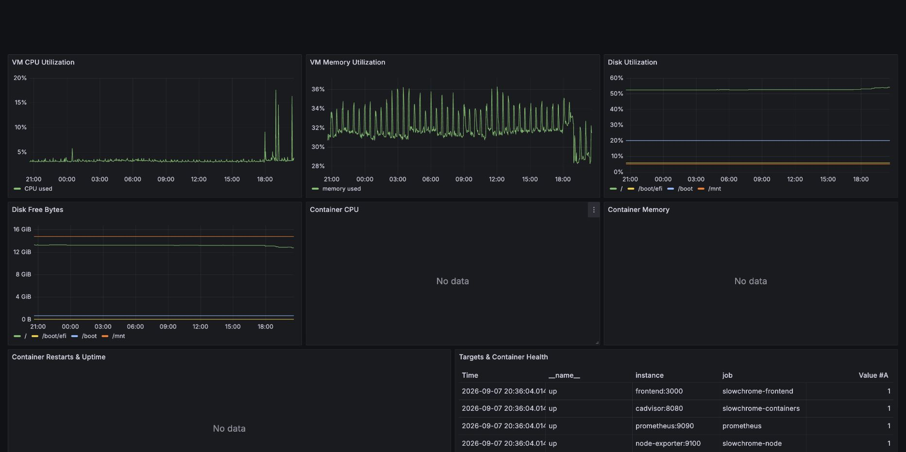
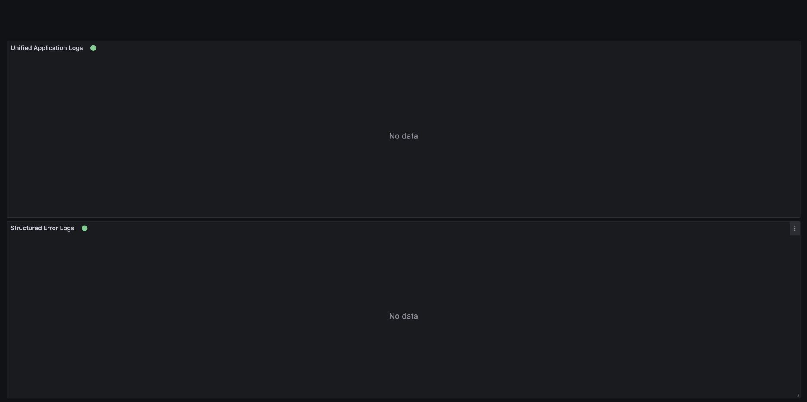

# SlowChrome Observability and Reliability Engineering Case Study

This case study explains how SlowChrome is monitored, diagnosed, and operated.
It expands on the [portfolio overview](../README.md) with the signal flow,
dashboard design, alert and SLO semantics, automated checks, and Kubernetes
work completed for the project.

> **Current scope:** the public application runs on an Azure Regular VM. The
> AKS environment described later was used for a time-boxed implementation and
> recovery exercise and is now stopped. SLI rules are implemented, but a
> completed 99.9% SLO observation window is not claimed.

## 1. Operating Context

SlowChrome lets a user upload a motorcycle image, validate whether the image is
suitable, configure a future build, request a bounded AI render, and save
user-owned state. The browser reaches Next.js through a Caddy HTTPS reverse
proxy. FastAPI and YOLOv8 remain private behind server-side routes. Supabase
provides identity, Postgres, Row Level Security, and private object storage;
OpenAI credentials stay server-side.

The production runtime is intentionally compact: Docker Compose on an Azure
Regular VM. The application and monitoring stack share a host, which keeps the
MVP understandable and cost-aware but also creates a known common failure
domain. That tradeoff is documented rather than hidden.

The same host runs Prometheus, Grafana, Loki, Alloy, Tempo, an OpenTelemetry
Collector, Alertmanager, node-exporter, and cAdvisor. Operations interfaces are
loopback-only and reached through authenticated operator access; they are not
public administration endpoints.

## 2. Incident-First Operating Model

The first observability iteration answered individual technical questions:
backend traffic, host saturation, container logs, traces, and active alerts.
However, several equally weighted dashboards forced an operator to decide where
to start before knowing which user journey was affected.

The dashboards are organized around the following incident-response workflow:

1. Grafana opens on **SlowChrome Incident Overview**.
2. The first row describes user-visible capabilities and critical telemetry
   health.
3. A small number of trend panels establish when behavior changed.
4. Panel links preserve the selected time range while opening a focused
   diagnostic dashboard.
5. Logs are consulted after a metric identifies the relevant service or stage.
6. Alerts and runbooks describe the action boundary; SLOs remain a separate
   long-window reliability view.

The dashboards deliberately distinguish `IDLE` from `UNKNOWN`. No recent
Supabase, OpenAI, or Garage traffic is not evidence of success, but it also is
not a datasource failure. This avoids turning normal low traffic into false
incidents.

## 3. Signal Architecture

```mermaid
flowchart TD
    probes["External synthetic probes"] --> cloudmetrics["Grafana Cloud metrics"]
    browser["Browser"] --> proxy["Caddy HTTPS reverse proxy"]
    proxy --> web["Next.js"]
    web --> api["Private FastAPI + YOLOv8"]
    web --> supabase["Supabase Auth / Postgres / Storage"]
    web --> openai["OpenAI Images"]

    web -->|"/api/metrics"| prom["Prometheus"]
    api -->|"/metrics"| prom
    exporters["node-exporter + cAdvisor"] --> prom
    cloudmetrics --> grafana["Grafana"]
    prom --> grafana

    web --> alloy["Grafana Alloy"]
    api --> alloy
    alloy --> loki["Loki"]
    loki --> grafana

    api --> otel["OpenTelemetry Collector"]
    otel --> tempo["Tempo"]
    tempo --> grafana

    prom --> rules["Alert + SLO rules"]
    rules --> alertmanager["Alertmanager"]
    alertmanager --> operator["Operator / conditional email receiver"]
```

### Application and dependency metrics

Backend HTTP metrics provide request rate, status, and latency by route. Next.js
adds product-specific metrics that are otherwise invisible to the private
FastAPI service:

- render requests grouped as `success`, `service_failure`, `rejected`, and
  `busy`;
- render duration and global in-flight work;
- configured per-user concurrency limit;
- Supabase authentication and OpenAI image-edit requests by outcome and
  duration;
- Garage save outcomes and latency;
- Garage stage outcomes and p95 duration for source upload, scratch upload,
  generated-image upload, and database write; and
- rejected advisory telemetry events.

The Garage browser workflow reports bounded, first-party operational events to a
server-side telemetry endpoint. The endpoint validates allowed stages,
outcomes, durations, content type, origin, and request size. It is an
observability input, not a billing or security authority.

### Logs and traces

Alloy discovers the application containers and forwards structured logs into
Loki. The default log view separates the unified operational stream from
error-like events. FastAPI spans travel through the OpenTelemetry Collector to
Tempo. Logs and traces add context after metrics narrow the search; they do not
replace service-level signals.

### Deployment correlation

Deployment timestamp metrics appear as Grafana annotations on relevant time
series. This makes “did the behavior change with a release?” a first-class
incident question without giving deployment metadata an oversized dashboard of
its own.

## 4. Incident Triage Workflow

```mermaid
flowchart LR
    detect["Detect user-visible symptom"] --> overview["Incident Overview"]
    overview --> scope{"Which capability?"}
    scope -->|"HTTP/API"| http["Rate · errors · latency · route outcomes"]
    scope -->|"AI / Auth / Garage"| deps["Outcomes · dependency latency · stages"]
    scope -->|"Resource"| infra["CPU · memory · disk · container health"]
    scope -->|"Long window"| slo["Availability · budget · AI SLIs"]
    http --> context["Logs / traces / deployment annotation"]
    deps --> context
    infra --> context
    context --> act["Alert + runbook + rollback/recovery"]
    act --> verify["Post-recovery user and telemetry checks"]
```

For example, an OpenAI status change begins on Incident Overview. The operator
keeps the incident time range while opening AI & Dependencies, checks the
failure ratio and dependency p95, correlates the first change with a deployment
annotation, and only then queries the relevant structured log or trace. After a
rollback or upstream recovery, the same user-level status and underlying metric
must recover before the incident is considered closed.

## 5. The Six-Dashboard System

All screenshots below were captured on 2026-09-07 from the active Regular VM
through private, authenticated access. They are static evidence, not public
Grafana links.

### 5.1 SlowChrome Incident Overview

**Operator question:** which user-visible capability or critical telemetry path
needs attention now?

The dashboard combines public probe status, Supabase Auth, OpenAI generation,
Garage persistence, firing alerts, critical Prometheus targets, public probe
latency, AI outcomes, render p50/p95, and a compact active-alert/target table.
`HEALTHY`, `IDLE`, and zero-valued critical counters are deliberately readable
without opening another surface.

### 5.2 SlowChrome HTTP/API Diagnostics

**Operator question:** did request rate, status class, route result, or latency
change?

The view applies RED-style diagnosis by route: traffic, HTTP error status class,
p50/p95 duration, 5xx ratio, and a categorical route outcome table. Normal
`No data` in an error panel is not colored as an outage.

### 5.3 SlowChrome AI & Dependencies

**Operator question:** is the user journey failing in AI rendering, concurrency,
Supabase/OpenAI, or Garage persistence?

Outcome groups separate service failures from intentional rejections and busy
responses. Concurrency saturation, render latency, dependency outcomes/p95, and
Garage stage metrics let an operator distinguish an upstream failure from local
capacity or persistence behavior.

### 5.4 SlowChrome Infrastructure

**Operator question:** is host or container saturation contributing to the
incident?

CPU, memory, disk utilization, free bytes, container resource signals,
restart/uptime data, and target health are concentrated here. They remain a
drill-down because high CPU is context, not proof that a user journey is broken.

### 5.5 SlowChrome Logs

**Operator question:** which structured event explains the metric change?

The public capture intentionally uses an empty historical window so raw log
lines, addresses, and request details are not published. In the private operator
view, the first panel provides a unified application stream and the second
focuses on structured error-like events.

### 5.6 SlowChrome Reliability & SLO

**Operator question:** what do the retained availability, error-budget, and AI
SLI signals show over the 14-day review window?

The dashboard combines an availability objective state, remaining error budget,
AI render success signal, availability history by probe, and AI success/latency
history. The capture proves that the rules are queryable; it does not by itself
prove completed SLO compliance.

## 6. Alert Strategy

The alert design favors actionable, sustained conditions over one-sample noise.

| Signal | Trigger design | Severity / intent |
| --- | --- | --- |
| Backend scrape | Target down for 2 minutes | Critical service availability |
| Exporter scrape | Target down for 5 minutes | Warning; observability degradation |
| Backend 5xx ratio | Above 5% for 5 minutes | Warning; sustained API failure |
| Backend p95 latency | Above 2 seconds for 5 minutes | Warning; sustained latency |
| Supabase Auth / OpenAI / Garage | At least 3 failures in 10 minutes, failure ratio above 50%, sustained for 1 minute | Critical user-journey dependency |
| Render saturation | At least 3 `busy` outcomes in 10 minutes, sustained for 2 minutes | Warning; bounded capacity pressure |
| Rejected telemetry | More than 10 rejected events in 10 minutes, sustained for 5 minutes | Warning; instrumentation contract issue |
| Root disk | Above 80% for 10 minutes | Warning; capacity risk |
| Container restart | Start-time change observed over 15 minutes, sustained for 1 minute | Warning; runtime instability |

Dependency alerts link to the focused AI & Dependencies dashboard and an
appropriate runbook. Combining event counts with ratios prevents a single failed
request in a quiet period from becoming a critical alert.

Prometheus routes active rules into Alertmanager. An email receiver can be
rendered from deployment secrets, but this case study does not claim that email,
Slack, or PagerDuty delivery is continuously exercised. The dated AKS drill
proves the internal Prometheus-to-Alertmanager transition and clear path.

## 7. Reliability and Low-Traffic SLO Semantics

Prometheus recording rules calculate:

- 14-day eligible AI render requests;
- 14-day successful AI render requests and success ratio;
- successful renders within the 90-second latency objective and latency ratio;
  and
- a sample-sufficiency gate requiring at least 20 eligible render requests.

Eligible requests include genuine service outcomes such as success, timeout,
configuration/auth availability failure, and upstream failure. Policy
rejections and `busy` saturation remain visible operational signals but do not
silently redefine service reliability.

The sample gate is important for a portfolio-scale service. A perfect ratio from
one request is not statistically persuasive. The implementation therefore
separates “the rule exists and is queryable” from “the service has accumulated
enough evidence to claim an objective.”

External probes currently contribute multi-location availability signals. A
formal 99.9% claim still requires a verified full window, calibrated probe
behavior, current datasource queries, and retained evidence covering the entire
period.

## 8. Observability as Code

The observability layer is changed and reviewed through the same engineering
workflow as application code.

| Contract | Automated evidence |
| --- | --- |
| Approved information architecture | Tests require exactly the six named SlowChrome dashboards and reject the retired standalone alert overview. |
| Stable navigation | Existing provisioned UIDs must remain unchanged; dashboard and alert links are checked against those UIDs. |
| Incident entry point | Compose configuration is tested to make Incident Overview the default Grafana home dashboard. |
| Time-preserving diagnosis | Drill-down panel links must carry the selected Grafana time range. |
| Panel scope | Tests assert the approved panels and prevent removed decorative or duplicated panels from returning. |
| Query contracts | Dashboard PromQL must reference the intended metrics and avoid embedding raw log queries in Incident Overview. |
| Alert behavior | Prometheus fixtures evaluate alert expressions against explicit input series. |
| SLO semantics | Rule fixtures cover sufficient samples, insufficient samples, success, latency, and failure cases. |

These tests do not prove that every production dependency is healthy. They prove
that dashboard changes preserve the operator contract and that rule semantics
are reproducible before deployment.

## 9. AKS Implementation and Recovery

I deployed SlowChrome and its observability stack end to end on AKS after first
practicing the Kubernetes workflow locally with Minikube. The managed cluster
was used to validate the cloud delivery path, Kubernetes telemetry, and
controlled recovery behavior without moving public traffic away from the
Regular VM.

| Area | Implementation |
| --- | --- |
| Infrastructure | Terraform managed the network, AKS, ACR, Key Vault, Workload Identity, and Gateway API foundation. Plans were reviewed before separately approved applies. |
| Delivery | GitHub Actions authenticated through Azure OIDC, used immutable ACR images, and released through Helm with readiness, rollout, and smoke checks. |
| Workloads | Next.js and private FastAPI ran as two-replica Deployments with readiness probes and PodDisruptionBudgets. |
| Observability | Prometheus, Grafana, Loki, Tempo, Alloy, OpenTelemetry Collector, Alertmanager, kube-state-metrics, and node-exporter ran behind private `ClusterIP` services. |

The observability components used the same operational model as the VM stack:
service-level metrics for detection, focused dashboards for diagnosis, and logs
or traces for additional context.

### Recovery results

| Exercise | Detection | Recovery / completion | Interpretation |
| --- | ---: | ---: | --- |
| Invalid backend readiness configuration | 370 s | 383 s | A deliberately invalid revision became visible and was rolled back to Ready. |
| Frontend Pod loss | 8 s | 9 s | The Deployment restored its desired frontend state. |
| Backend Pod loss | 7 s | 14 s | The private backend returned to its expected replica count. |
| Internal alert pipeline | 41 s | 345 s clear | A rule transitioned through Alertmanager and resolved; no external receiver is claimed. |
| Workload-node drain | — | 15 s drain; 28 s controlled recovery | PDB-guarded planned maintenance rescheduled workloads. This is not incident MTTD/MTTR. |

The cluster was stopped after the exercise because its ongoing cost and
operational overhead were not justified by the project's current traffic. I
continue practicing the workflow locally with Minikube while retaining these
deployment and recovery results.

## 10. Security, Privacy, and Cost Boundaries

| Boundary | Control / decision |
| --- | --- |
| Delivery identity | GitHub-to-Azure OIDC avoids a long-lived cloud delivery secret in CI. |
| Application secrets | Cloud secret storage and workload identity are used without publishing values here. |
| Network exposure | The private backend and observability administration surfaces are not public endpoints. |
| Portfolio evidence | Screenshots exclude credentials, user data, cloud IDs, and public infrastructure addresses; the Logs screenshot intentionally contains no raw lines. |
| Cost control | The production VM remains proportionate to current traffic; the AKS environment is stopped. |

## 11. Current Limitations

The following remain gaps or separate decisions:

1. a completed, retained 99.9% SLO compliance window;
2. continuously exercised email, Slack, or PagerDuty delivery;
3. a completed Supabase backup/restore drill;
4. multi-region availability;
5. AKS public DNS/TLS cutover or sustained production traffic;
6. shared render concurrency state suitable for honest multi-replica frontend
   scaling.
